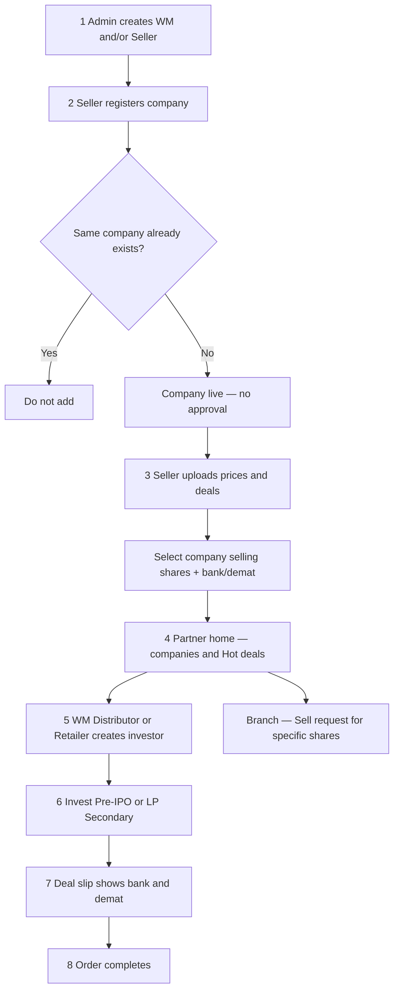

# START HERE — Partner marketplace (whole story)

**Open this file first.**  
One page for stakeholders to understand the full product story. Every other doc is linked from here.

---

## How to use this page

1. Read the **big picture** flowchart (2 minutes).  
2. Skim the **rules** boxes.  
3. Click any **child flow** for detail when someone asks “how does X work?”  
4. Use **Who is who** if roles are confusing.

---

## Big picture (whole story)



### Story in plain English

1. **Admin** creates a **Wealth Manager** and/or a **Seller** (Seller can be created like WM).  
2. **Channel tree** is built (see hierarchy below).  
3. **Seller** registers a company → if new, it is **live immediately** (no approval). If it already exists, **do not add**.  
4. **Seller** uploads **prices** and **deals**, picks **which company is selling**, using their **bank/demat** accounts.  
5. **WM / Distributor / Retailer** see companies on **home** and **Hot deals**.  
6. They **create their own investors** and **invest** for them (**Pre-IPO / unlisted** or **LP Secondary** — same process).  
7. On invest, the **deal slip** shows that transaction’s **bank + demat**.  
8. Order goes to **complete**.  
9. Or they raise a **sell request** for specific shares (separate from invest).

---

## Channel hierarchy (who sits where)

```text
Admin panel creates:
  ├── Wealth Manager (main)
  │     ├── Seller (optional under WM)
  │     │     ├── Distributor → investors + retailers → investors
  │     │     └── Retailer → investors
  │     ├── WM’s own Investors
  │     ├── Distributor → investors + retailers → investors
  │     └── Retailer → investors
  └── Seller (created like WM)
        ├── Distributor → investors + retailers → investors
        └── Retailer → investors
           (Seller has NO own investors)
```

| Role | Own investors? | Notes |
|------|----------------|--------|
| Wealth Manager | **Yes** | Main channel; creates Seller / Distributor / Retailer |
| Seller | **No** | Admin or under WM; has Distributor + Retailer; prices & deals |
| Distributor | **Yes** | Under WM or Seller; also has retailers |
| Retailer | **Yes** | Under WM, Seller, or Distributor |
| Admin | — | Creates WM/Seller; **sees/monitors** (does not approve companies to go live) |

Full hierarchy detail → [Flow A](workflows/flows/wm-create-seller-distributor.md)

---

## Child flows (click for detail)

| # | What it covers | Open |
|---|----------------|------|
| **A** | Admin / WM / Seller hierarchy, Distributor, Retailer, investors | [Flow A](workflows/flows/wm-create-seller-distributor.md) |
| **B** | Seller registers company — no approval; block duplicates | [Flow B](workflows/flows/seller-register-company.md) |
| **C** | Note only — go-live is part of B (no separate approval) | [Flow C](workflows/flows/company-goes-live.md) |
| **D** | Prices, deals, selling company, bank/demat | [Flow D](workflows/flows/seller-prices-and-deals.md) |
| **E** | Partner home — companies & Hot deals | [Flow E](workflows/flows/partner-discovers-company.md) |
| **F** | WM / Distributor / Retailer create investor | [Flow F](workflows/flows/partner-create-investor.md) |
| **G** | Invest (Pre-IPO or LP Secondary) + deal slip bank/demat | [Flow G](workflows/flows/partner-invest-for-investor.md) |
| **H** | Deal slip → payment → complete | [Flow H](workflows/flows/order-to-complete.md) |
| **I** | Sell request for specific shares | [Flow I](workflows/flows/partner-sell-request.md) |

Same story also lives at: [workflows/whole-project-flow.md](workflows/whole-project-flow.md) (duplicate entry for the docs index).

---

## Important rules (quick)

| Topic | Rule |
|-------|------|
| Company create | Live immediately — **no approval** |
| Duplicate company | If same company exists → **do not add** |
| Seller commercial | Same seller uploads **prices + deals**; multi companies; multi bank/demat; **select selling company** on deal |
| Invest types | Home companies **or** Hot deals |
| Products | **Pre-IPO / unlisted** and **LP Secondary** — **same invest process** |
| Deal slip | **Transaction-level** bank + demat for that deal |
| Who invests | WM / Distributor / Retailer only — **not Seller** |

---

## Other useful files (after this page)

| File | When to open |
|------|----------------|
| [actors/README.md](actors/README.md) | Role cards + same flow links |
| [modules/partner-business.md](modules/partner-business.md) | Partner module capabilities |
| [database/partner.md](database/partner.md) | Simple data / relationship picture |
| [docs/README.md](README.md) | Full documentation index (engineering + stakeholders) |

---

## For technical team

These pages describe the **target** product. Application code may still differ (`seller_master`, company approval, etc.) until implementation. Code changes are a later task.
