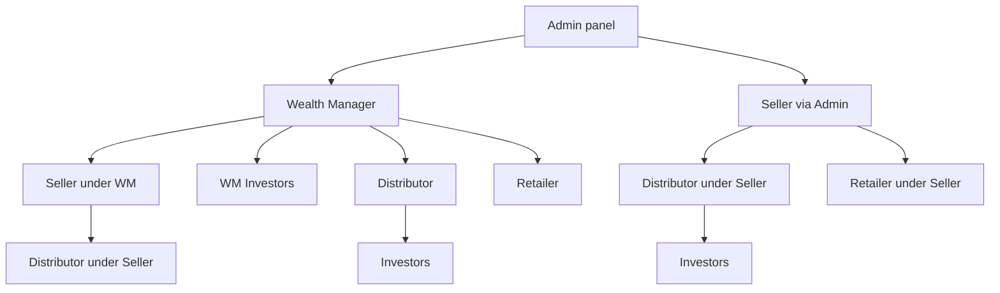

# Actors hub — Partner marketplace

**Start here for stakeholders.**  
This hub explains **who is who**, then sends you to the **whole project flow** and each **individual flow**.

---

## Show this first

| Document | Use in meetings |
|----------|-----------------|
| [**START-HERE.md**](../START-HERE.md) | **One file** — full story + all child links |
| [Whole project flow](../workflows/whole-project-flow.md) | Same journey under workflows/ |

---

## Who is who

| Role | In plain language |
|------|-------------------|
| **Wealth Manager** | **Main** channel. Created from **Admin**. Creates Seller, Distributor, Retailer (direct). Has **own investors**. |
| **Seller** | Created from **Admin** (like WM) **or** under WM. Has **Distributor** + **Retailer** below. Uploads prices/deals. **No own investors.** |
| **Distributor** | Under WM **or** Seller. Own investors + own retailers. |
| **Retailer** | Under WM, Seller, or Distributor. Own investors only. |
| **Investor** | Under WM, Distributor, or Retailer only (never under Seller). |
| **Admin** | Creates WM and Seller from admin panel; can see/monitor companies and orders. |

---

## Detail pages (click any)

| Topic | Link |
|-------|------|
| Channel hierarchy — Admin/WM/Seller, Distributor, Retailer, investors | [Open](../workflows/flows/wm-create-seller-distributor.md) |
| Seller registers a company (duplicate check; live immediately) | [Open](../workflows/flows/seller-register-company.md) |
| Company goes live — *no separate approval* | [Open](../workflows/flows/company-goes-live.md) |
| Seller uploads prices & deals (select selling company; bank/demat) | [Open](../workflows/flows/seller-prices-and-deals.md) |
| Partner home — companies & Hot deals | [Open](../workflows/flows/partner-discovers-company.md) |
| Create investor | [Open](../workflows/flows/partner-create-investor.md) |
| Invest (Pre-IPO or LP Secondary; deal slip bank+demat) | [Open](../workflows/flows/partner-invest-for-investor.md) |
| Order completes | [Open](../workflows/flows/order-to-complete.md) |
| Sell request for specific shares | [Open](../workflows/flows/partner-sell-request.md) |

---

## More detail

- [Partner module](../modules/partner-business.md)  
- [Partner database / schema](../database/partner.md)  
- [Documentation index](../README.md)

---

## Current vs target (one note)

**Target (these docs):** Seller is a **partner role**. Admin creates WM or Seller; Seller has Distributor/Retailer below but **no investors**; WM/Distributor/Retailer invest.  
**Today’s code:** Seller may still be `seller_master`; partner types may not yet include `seller`. Implementation comes later.
