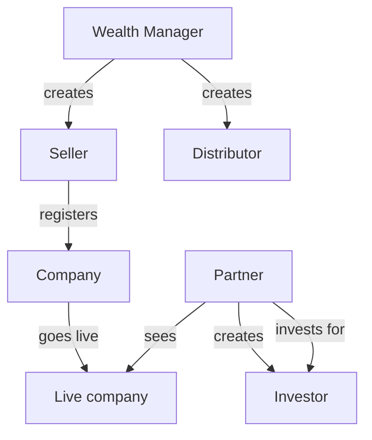

# Actors hub — Partner marketplace

**Start here for stakeholders.**  
This hub explains **who is who**, then sends you to the **whole project flow** and each **individual flow**.

---

## Show this first

| Document | Use in meetings |
|----------|-----------------|
| [**Whole project flow**](../workflows/whole-project-flow.md) | Full story + one flowchart |
| Individual flows (below) | Deep dive on one step |

---

## Who is who

| Role | In plain language |
|------|-------------------|
| **Wealth Manager** | Top channel role. Can **create Seller** and **Distributor**. |
| **Seller** | Partner role that **registers companies**, sets prices/deals, and tracks orders. *(Target model — code later.)* |
| **Distributor** | Channel partner under the network (created by Wealth Manager). |
| **Retailer** | Channel partner type (as today). |
| **Relation Manager** | Channel partner type (as today). |
| **Partner (general)** | Anyone in the partner network acting on business flows — especially **creating investors** and **investing for them**. |
| **Investor** | A record **created by a Partner** in this product path (not a self-serve journey in these docs). |
| **Admin** | Can **see and monitor** companies and orders. Not the main driver of this story. |

---

## Individual flows (click any)

| # | Flow | Link |
|---|------|------|
| A | Wealth Manager creates Seller and Distributor | [Open](../workflows/flows/wm-create-seller-distributor.md) |
| B | Seller registers a company | [Open](../workflows/flows/seller-register-company.md) |
| C | Company goes live | [Open](../workflows/flows/company-goes-live.md) |
| D | Seller sets prices and deals | [Open](../workflows/flows/seller-prices-and-deals.md) |
| E | Partner sees the company | [Open](../workflows/flows/partner-discovers-company.md) |
| F | Partner creates an investor | [Open](../workflows/flows/partner-create-investor.md) |
| G | Partner invests for that investor | [Open](../workflows/flows/partner-invest-for-investor.md) |
| H | Order completes | [Open](../workflows/flows/order-to-complete.md) |

---

## More detail

- [Partner module](../modules/partner-business.md)  
- [Partner database / schema](../database/partner.md)  
- [Documentation index](../README.md)

---

## Current vs target (one note)

**Target (these docs):** Seller is a **partner role**; WM creates Seller + Distributor.  
**Today’s code:** Seller capabilities may still live on a separate seller account (`seller_master`). Partner types may not yet include `seller`. Implementation comes later — docs describe the intended product.
