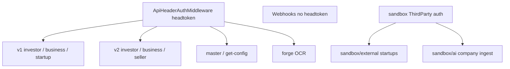

# API Overview

## Base

Laravel registers `routes/api.php` with default `/api` prefix.

## Version map

## Controllers map

| Area | Namespace |
|------|-----------|
| V1 Investor | `Api\V1\Investor\` |
| V1 Business | `Api\V1\Business\` |
| V1 Startup | `Api\V1\Startup\` |
| V2 Investor | `Api\V2\Investor\` |
| V2 Business | `Api\V2\Business\` |
| V2 Seller | `Api\V2\Seller\` |
| Master / config | `Api\MasterController`, `Api\ConfigController` |
| Upload/OCR | `Api\UploadAndParseController` |
| Guest FCM | `Api\GuestDeviceTokenController` |
| Third party | `ThirdParty\StartupController`, `ThirdParty\AiCompanyIngestController` |
| Webhooks | `WebhookController` |
| PrivateDeals form | `Api\PrivateDealsController` (open, no headtoken) |

## Documentation split

- [v1.md](v1.md) — V1 surfaces
- [v2.md](v2.md) — V2 surfaces
- [webhooks-third-party.md](webhooks-third-party.md)
- Focused Pre-IPO payload notes: [preipo-v2-unlisted-secondary-api-changes.md](../preipo-v2-unlisted-secondary-api-changes.md)

## Conventions for changes

1. Prefer additive JSON fields.
2. Mirror partner/business endpoints when investor behavior changes on shared methods.
3. Update feature + API docs in the same PR/task.
4. Record breaking changes explicitly in the relevant feature doc.
