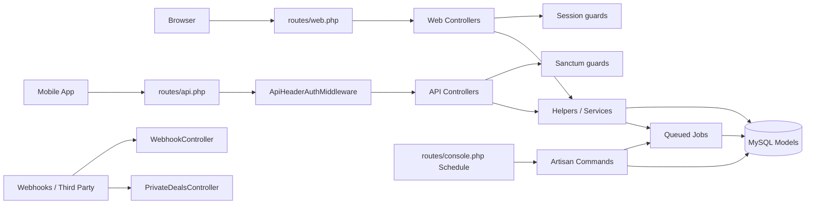
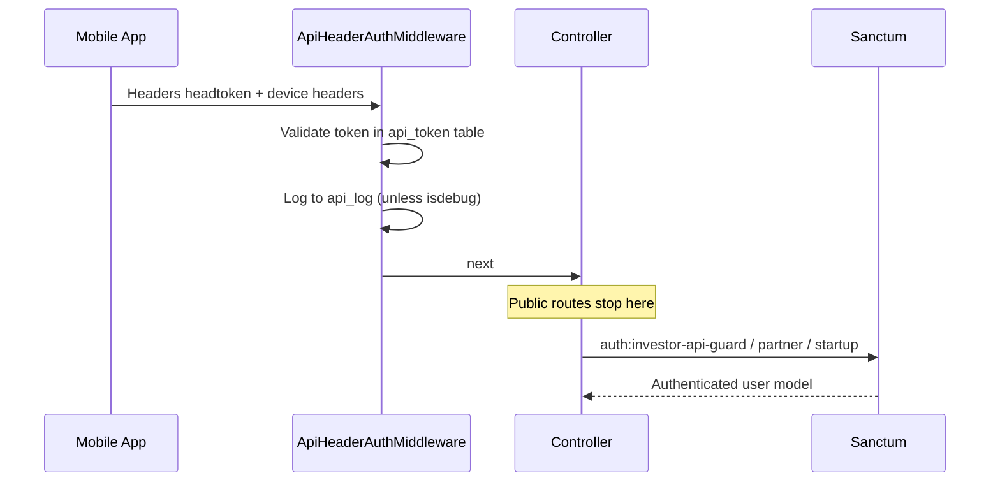

# Architecture Overview

## Style

**Laravel 11 monolith** with:

- Multi-guard session web apps (admin / investor / partner / startup)
- Sanctum token APIs for mobile (investor / partner / startup)
- Additional API gate: `headtoken` header (`ApiHeaderAuthMiddleware`)
- Database-backed **queue**, **cache**, and **session** (per `.env.example`)
- Optional **S3** filesystem (`FILESYSTEM_DISK`)
- Livewire 3 for selected admin/front widgets
- Spatie Permission for admin rights (`hasPermission` middleware alias)
- Telescope for local/debug observability
- Spatie Backup for DB backups (scheduled)

---

## Layering (as implemented)

| Layer | Location | Reality check |
|-------|----------|----------------|
| Routes | `routes/*.php` | Large, permission-heavy admin map |
| Controllers | `app/Http/Controllers/**` | Often contain business rules + response shaping |
| Helpers | `app/Helpers/**` | Transaction status machines, Digio, uploads, WhatsApp |
| Services | `app/Services/**` | Small set: FCM, Demat parse/KYC, Pre-IPO day/timer |
| Repositories | `app/Repositories/**` | Used for some investor/partner/startup data access |
| Models | `app/Models/**` | Fat models common; domain tables mapped 1:1 |
| Jobs | `app/Jobs/**` | Async notifications and some Pre-IPO/secondary work |
| Views | `resources/views/**` | Admin Metronic-style theme via `app/Core` |

There is **no** formal domain-driven folder split (e.g. `Domains/PreIpo`). Features cut across controllers, helpers, models, and jobs.

---

## API versioning

| Version | Prefix | Focus |
|---------|--------|--------|
| V1 | `/api/v1/investor`, `/api/v1/business`, `/api/v1/startup` | Mature surfaces: primary, secondary, Pre-IPO, KYC, partner ops |
| V2 | `/api/v2/investor`, `/api/v2/business` | Newer investor UX: auth (OTP/Google/MPIN), Pre-IPO home, coupons, price alerts, Calendly, combined portfolio; business Pre-IPO + secondary home/`company.type` |

V2 still **reuses** some V1 controller methods (e.g. home/startup list routes point at V1 common controller).

See [api/overview.md](../api/overview.md).

---

## Auth architecture (summary)

Web admin uses session + `AdminPermissionsMiddleware` (`hasPermission:…` strings in `routes/web.php`).

Details: [authentication/overview.md](../authentication/overview.md).

---

## Configuration bootstrap risk

`SettingServiceProvider` loads **all** `AppSettingsModel` rows at boot and shares them with every view as `globalsettings`. Fresh installs must temporarily disable this until migrations/seed exist (documented in root `README.md`).

---

## Storage & files

`FileUpDownHelper` centralizes uploads (including Pre-IPO payment receipts). Disk is `local` or `s3` via `FILESYSTEM_DISK`. Chunk upload support via `pion/laravel-chunk-upload`.

---

## Background processing

- **Queue connection**: `database` (default in `.env.example`)
- **Dispatchers**: WhatsApp + push every 2 minutes; Calendly sync every minute; share price updates; KYC reminders; renewal reminders; Telescope prune; DB backup
- Many Pre-IPO reminder/escalation schedules exist but are **commented out** in `routes/console.php` — treat as intentionally disabled unless re-enabled

See [deployment/overview.md](../deployment/overview.md).

---

## Important coupling

| Change area | Likely ripple |
|-------------|---------------|
| Pre-IPO status / Digio docs | Admin Pre-IPO controller, `PreIpoTransactionHelper`, Digio webhook, investor V1+V2 APIs, jobs |
| Company price fields | Home APIs, admin company UI, daily price commands, portfolio valuations |
| `company.type` (`unlisted`/`secondary`) | Business v2 Pre-IPO APIs (see focused change doc) |
| KYC document types | Forge OCR endpoints, Digio, admin manual KYC, investor APIs |
| Partner hierarchy | Earnings APIs, investor creation under partner, WhatsApp PDF blasts |

More: [architecture/cross-cutting-risks.md](cross-cutting-risks.md).
