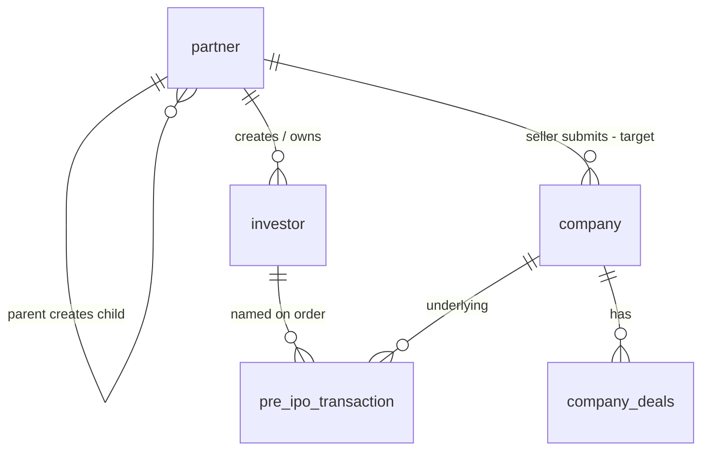

# Database: Partner network

**In one sentence:** Partners (including the target **Seller** role) live on the `partner` table; investors created by partners point back with `partner_id`.

> **Stakeholders:** use the diagram below.  
> **Technical columns** are listed after.

---

## Relationship picture

**Plain language:**

- A **Wealth Manager** partner can create child partners: **Seller** and **Distributor** (target rules).  
- A **Partner** creates **investors** linked to them.  
- A **Seller** registers **companies** that go live after approval.  
- Investments reference the investor and company (and later the seller on the order).

---

## Partner types (target)

| Type | Meaning |
|------|---------|
| Wealth Manager | Creates Seller and Distributor |
| Seller | Registers companies, prices, deals, tracks orders |
| Distributor | Channel partner |
| Retailer | Channel partner |
| Relation Manager | Channel partner |

---

## Important fields (partner)

| Area | Examples |
|------|----------|
| Identity | name, mobile, email, uuid |
| Role | `type` (includes **seller** in target model) |
| Hierarchy | `parent_id`, `parent_type` |
| Access | product access flags (primary / secondary / pre-ipo style) |
| Status | active / blocked / demo style flags |

**Investor (as partner-owned record only):** `partner_id` links the investor to the creating partner. Full investor schema is not expanded in this stakeholder pack.

---

## Related tables sellers care about

| Table / concept | Role |
|-----------------|------|
| `company` | Submitted by seller; pending then live |
| Share price / seller quotes | Commercial prices |
| `company_deals` | Deals on companies |
| `pre_ipo_transaction` | Orders partners place for investors |
| Enquiries | Optional partner interest (not an order) |

---

## Current vs target

| Topic | Target (docs) | Current code (until migration) |
|-------|---------------|--------------------------------|
| Seller identity | Row on `partner` with type Seller | Often `seller_master` |
| WM creates Seller | Allowed | Not in `PartnerTypeEnum` yet |
| Company submit | Seller partner | Seller API / `submitted_by_seller_id` toward seller master |

---

## Related

- [Actors hub](../actors/README.md)  
- [Whole project flow](../workflows/whole-project-flow.md)  
- [Partner module](../modules/partner-business.md)  
- [Database overview](overview.md)

---

## For technical team

Model: `app/Models/PartnerModel.php`. Enum today: `app/Enums/PartnerTypeEnum.php` (no `seller` case yet). Investor: `InvestorModel.partner_id`.
