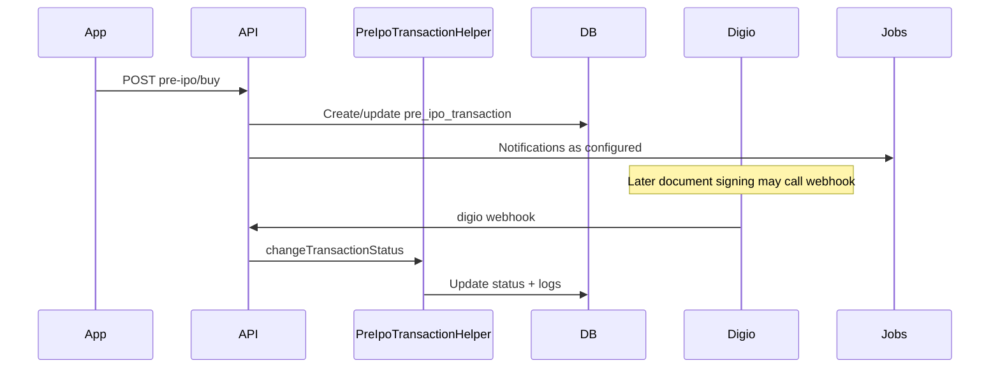

# Feature: Pre-IPO / Unlisted Equity

## Purpose

Enable investors (and partners) to buy/sell pre-IPO / unlisted company shares, track transaction status, portfolios, and market listings.

## Responsibilities

- Company discovery (home, trending, exclusive, liquid, DRHP, etc. via `PreIpoCategoryEnum`)
- Buy / sell / cancel orders
- Payment receipt upload
- Transaction detail + status timeline for apps
- Portfolio Pre-IPO holdings
- Admin operational management
- Optional timers / reminders / auto-cancel (commands exist; some schedules disabled)

## Entry points

| Kind | Location |
|------|----------|
| API V1 investor | `/api/v1/investor/pre-ipo/*` |
| API V1 business | `/api/v1/business/pre-ipo/*` |
| API V2 investor | `/api/v2/investor/pre-ipo/*`, `get-preipo-home`, etc. |
| API V2 business | `/api/v2/business/home/pre-ipo`, `home/secondary`, `pre-ipo/transaction-list`, company list, `enquiries/create` |
| API V2 seller | `/api/v2/seller/dashboard`, `/api/v2/seller/pre-ipo/transaction`, `transaction/detail` (scoped to `seller_id`) |
| Admin | `/admin/pre-ipo-transactions`, `/admin/company-enquiry` |
| Helpers | `PreIpoTransactionHelper`, `TransactionCalculationHelper` |
| Services | `PreIpoTimerService`, `PreIpoBusinessDayService` |

## Important models / tables

| Model | Table |
|-------|-------|
| `PreIpoModel` | `pre_ipo_transaction` |
| `PreIpoSellRequestModel` | (see model `$table`) |
| `PreIpoTransactionPaymentsModel` | payments |
| `PreIpoStatusLogModel` | status logs |
| `PortfolioPreIpoModel` | `portfolio_preipo` |
| `CompanyModel` | `company` (+ `type`: unlisted/secondary) |
| `SellerMasterModel` | `seller_master` (Pre-IPO counterparty KYC + Flutter seller API login via Sanctum; optional `logo` path under `seller/logo/`; feature flags `is_primary_access`, `is_secondary_access`, `is_preipo_access` like investor) |
| `CompanyGrabOpportunitySlotModel` | grab slots |
| `CompanyEnquiryModel` | `company_enquiries` (partner buy/sell enquiry on company/deal) |

## Data flow (buy — conceptual)

## Business rules

- Admin seller CRUD (`/admin/seller`) supports optional `logo` upload stored on `seller_master` under `seller/logo/`. Seller V2 login/profile/forgot and `POST /profile/update` return `logo` as an absolute URL; when unset, initials are generated from `company_name` via ui-avatars (not a static square placeholder).
- Seller feature access mirrors investor: `is_primary_access`, `is_secondary_access`, `is_preipo_access` on `seller_master` (defaults `0`; admin create/edit toggles; existing rows backfilled to `1` by migration).
- `company.type` separates **unlisted** vs **secondary** markets for business v2 list/home/news APIs — do not mix payloads. See `docs/preipo-v2-unlisted-secondary-api-changes.md`.
- DRHP list filter (`category=DRHP`) matches `is_drhp=1` and excludes Coming Soon / Listed, but must still return rows where `category` is null (explicit `whereNull` — SQL `!=` drops nulls).
- V2 status timelines use `PreIpoTransactionHelper::getStatusListForApplicationV2`.
- Transaction calculations: `POST .../pre-ipo/calculate-transaction` → `TransactionCalculationController`.
- V1 buy (`POST .../pre-ipo/buy`): optional `seller_id` (scalar or parallel array) saved on new `pre_ipo_transaction` rows.
- Coupons may apply on V2 buy paths — verify coupon enums/scopes.

## Configuration / schedule

- Commands: `AutoCancelPreIpoTransactions`, reminder/escalation commands under `app/Console`
- Many related schedules in `routes/console.php` are commented out
- Active: `app:dispatch-preipo-transaction-reminder-message` daily 11:30

## Common modification points

- Response shaping for home/lists: V2 investor/business `CommonController`
- Status machine: `PreIpoTransactionHelper`
- Admin ops UI: `PreIpoTransactionController`

## Side effects / risks

- Changing buy validation affects investor **and** partner apps (shared controller methods on V1).
- Digio + document type changes affect status progression.
- Share price jobs update company valuations used in home widgets.

## Related features

- [companies-pricing.md](companies-pricing.md)
- [portfolio.md](portfolio.md)
- [kyc-demat.md](kyc-demat.md)
- [coupons-referrals.md](coupons-referrals.md)
- [workflows/pre-ipo-buy-sell.md](../workflows/pre-ipo-buy-sell.md)
