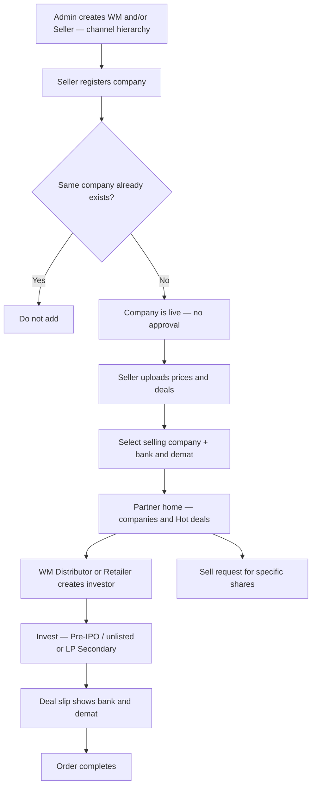

# START HERE — Partner marketplace (whole story)

**Open this file first.**  
One page for stakeholders. Everything else is linked from here.

---

## How to use this page

Read the story and flowchart below. Open **diagrams** for Swimlane / Use Case / Flowchart views. Open a **detail page** when you need more on one topic.

---

## Diagrams (Swimlane · Use Case · Flowchart)

| Diagram | Open |
|---------|------|
| Diagrams index | [diagrams/README.md](diagrams/README.md) |
| Flowchart | [diagrams/flowchart.md](diagrams/flowchart.md) |
| Swimlane activity | [diagrams/swimlane-activity.md](diagrams/swimlane-activity.md) |
| Use case | [diagrams/use-case.md](diagrams/use-case.md) |

---

## Whole story (flowchart)



---

## Whole story (plain English)

**Setup**  
Admin creates a **Wealth Manager** and/or a **Seller** (Seller can be created like WM). The channel tree is built — who sits under whom is in [Channel hierarchy](#channel-hierarchy-who-sits-where) and [Hierarchy detail](workflows/flows/wm-create-seller-distributor.md).

**Seller adds inventory**  
Seller registers a company. If it is **new**, it is **live immediately** (no approval). If the **same company already exists**, it is **not** added.  
Then the Seller uploads **prices** and **deals**, chooses **which company is selling the shares**, and uses their **bank / demat** accounts.  
→ [Register company](workflows/flows/seller-register-company.md) · [Prices and deals](workflows/flows/seller-prices-and-deals.md)

**Partners use the marketplace**  
**WM / Distributor / Retailer** see companies on **home** and **Hot deals**. They create **their own investors** and **invest** for them.  
**Pre-IPO / unlisted** and **LP Secondary** use the **same** invest process.  
On invest, the **deal slip** shows that transaction’s **bank + demat**. Then the order completes.  
→ [Home and Hot deals](workflows/flows/partner-discovers-company.md) · [Create investor](workflows/flows/partner-create-investor.md) · [Invest](workflows/flows/partner-invest-for-investor.md) · [Order complete](workflows/flows/order-to-complete.md)

**Sell path (separate)**  
They can also raise a **sell request** for **specific shares** (not the same as investing).  
→ [Sell request](workflows/flows/partner-sell-request.md)

---

## Channel hierarchy (who sits where)

```text
Admin panel creates:
  ├── Wealth Manager (main)
  │     ├── Seller (optional under WM)
  │     │     ├── Distributor → investors + retailers → investors
  │     │     └── Retailer → investors
  │     ├── WM’s own Investors
  │     ├── Distributor → investors + retailers → investors
  │     └── Retailer → investors
  └── Seller (created like WM)
        ├── Distributor → investors + retailers → investors
        └── Retailer → investors
           (Seller has NO own investors)
```

| Role | Own investors? | Notes |
|------|----------------|--------|
| Wealth Manager | **Yes** | Main channel; creates Seller / Distributor / Retailer |
| Seller | **No** | Admin or under WM; has Distributor + Retailer; prices & deals |
| Distributor | **Yes** | Under WM or Seller; also has retailers |
| Retailer | **Yes** | Under WM, Seller, or Distributor |
| Admin | — | Creates WM/Seller; **sees/monitors** (does not approve companies to go live) |

---

## Important rules

| Topic | Rule |
|-------|------|
| Company create | Live immediately — **no approval** |
| Duplicate company | If same company exists → **do not add** |
| Seller commercial | Same seller uploads **prices + deals**; multi companies; multi bank/demat; **select selling company** on deal |
| Invest from | Home companies **or** Hot deals |
| Products | **Pre-IPO / unlisted** and **LP Secondary** — **same invest process** |
| Deal slip | **Transaction-level** bank + demat for that deal |
| Who invests | WM / Distributor / Retailer only — **not Seller** |

---

## Detail pages (open when you need more)

| Topic | Open |
|-------|------|
| Channel hierarchy (Admin / WM / Seller / Distributor / Retailer) | [Hierarchy](workflows/flows/wm-create-seller-distributor.md) |
| Seller registers company | [Register company](workflows/flows/seller-register-company.md) |
| Go-live note (no separate approval) | [Go-live note](workflows/flows/company-goes-live.md) |
| Prices, deals, selling company, bank/demat | [Prices and deals](workflows/flows/seller-prices-and-deals.md) |
| Partner home and Hot deals | [Home and Hot deals](workflows/flows/partner-discovers-company.md) |
| Create investor | [Create investor](workflows/flows/partner-create-investor.md) |
| Invest + deal slip | [Invest](workflows/flows/partner-invest-for-investor.md) |
| Order complete | [Order complete](workflows/flows/order-to-complete.md) |
| Sell request | [Sell request](workflows/flows/partner-sell-request.md) |

Also: [Actors hub](actors/README.md) · [Partner module](modules/partner-business.md) · [Database schema](database/partner.md) · [Diagrams](diagrams/README.md) · [Docs index](../README.md)

---

## For technical team

These pages describe the **target** product. Application code may still differ until implementation. Code changes are a later task.
