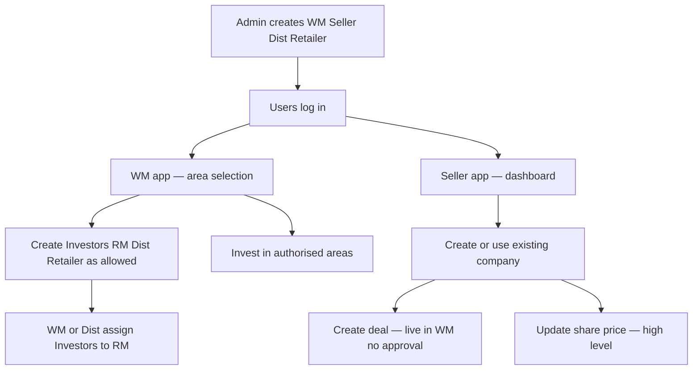

# START HERE — Partner marketplace (new system)

**Open this file first** for the product story.  
**Business diagrams (use cases, swimlanes, permissions):** → **[business-diagrams/README.md](business-diagrams/README.md)**

---

## Two applications

| Application | Who |
|-------------|-----|
| **Wealth Manager** app | WM, Distributor, Retailer, Relationship Manager |
| **Private Deal Seller** app | Seller only (no subordinate users) |
| **Admin** | External app (outside this project scope); can view all data |

---

## Business diagrams pack

| Item | Open |
|------|------|
| Diagrams index | [business-diagrams/README.md](business-diagrams/README.md) |
| Role–permission table | [business-diagrams/role-permissions.md](business-diagrams/role-permissions.md) |
| Assumptions & questions | [business-diagrams/assumptions-and-questions.md](business-diagrams/assumptions-and-questions.md) |
| Use cases — Admin | [business-diagrams/use-cases/admin.md](business-diagrams/use-cases/admin.md) |
| Use cases — WM family | [business-diagrams/use-cases/wealth-manager.md](business-diagrams/use-cases/wealth-manager.md) |
| Use cases — Seller | [business-diagrams/use-cases/seller.md](business-diagrams/use-cases/seller.md) |
| Swimlanes A–F | [business-diagrams/swimlanes/](business-diagrams/swimlanes/) |
| PlantUML sources | [business-diagrams/plantuml/](business-diagrams/plantuml/) |

Also: older Mermaid pack under [diagrams/](diagrams/) (superseded for stakeholder reviews by **business-diagrams**).

---

## Whole story (high level)



---

## Hierarchy (confirmed)

```text
Admin (external)
├── Wealth Manager — areas assigned by Admin
│     ├── Relationship Manager — assigned Investors only
│     ├── Investors
│     ├── Distributor — subset of WM areas
│     │     ├── Relationship Manager
│     │     ├── Investors
│     │     └── Retailers → Investors
│     └── Retailer → Investors
├── Seller — no users below
├── Distributor — may be independent (no parent)
└── Retailer — may be independent (no parent)
```

| Rule | Status |
|------|--------|
| WM cannot create Seller | Confirmed |
| Seller cannot create users | Confirmed |
| Admin does not create Investors or RMs | Confirmed |
| Parent grants only areas it has | Confirmed |
| Cascade revoke of areas to subordinates | **Provisional** |

Full detail: [workflows/flows/wm-create-seller-distributor.md](workflows/flows/wm-create-seller-distributor.md)

---

## Investment areas (access, not roles)

1. Primary Startup — Private Equity  
2. Secondary Startup — LP Secondary  
3. PRE-IPO — Unlisted Shares  

---

## Also useful

- [Actors](actors/README.md)  
- [Partner module](modules/partner-business.md)  
- [Database](database/partner.md)  
- [Docs index](../README.md)  
