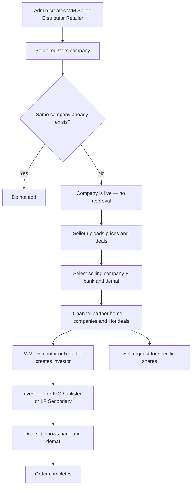

# START HERE — Partner marketplace (whole story)

**Open this file first.**  
One page for stakeholders. Everything else is linked from here.

---

## How to use this page

Read the story and flowchart below. Open **diagrams** for Swimlane / Use Case / Flowchart views. Open a **detail page** when you need more on one topic.

---

## Diagrams (Swimlane · Use Case · Flowchart)

| Diagram | Open |
|---------|------|
| Diagrams index | [diagrams/README.md](diagrams/README.md) |
| Flowchart | [diagrams/flowchart.md](diagrams/flowchart.md) |
| Swimlane activity | [diagrams/swimlane-activity.md](diagrams/swimlane-activity.md) |
| Use case | [diagrams/use-case.md](diagrams/use-case.md) |

---

## Whole story (flowchart)



---

## Whole story (plain English)

**Setup**  
**Admin** creates **Wealth Manager**, **Seller**, and can also create **Distributor** / **Retailer**.  
**WM cannot create Seller.** **Seller cannot create any other user** (Seller only).  
Channel partners (WM / Distributor / Retailer) have investors; **RM** manages company data and assigns investors for **WM** and **Distributor**.  
→ [Hierarchy detail](workflows/flows/wm-create-seller-distributor.md)

**Seller adds inventory**  
Seller registers a company. If **new** → **live immediately** (no approval). If **already exists** → **do not add**.  
Seller uploads **prices** and **deals**, selects **selling company**, uses **bank / demat**.  
→ [Register company](workflows/flows/seller-register-company.md) · [Prices and deals](workflows/flows/seller-prices-and-deals.md)

**Channel partners use the marketplace**  
**WM / Distributor / Retailer** see **home** and **Hot deals**, create **own investors**, and **invest**.  
**Pre-IPO / unlisted** and **LP Secondary** — **same** process. Deal slip shows **bank + demat**.  
→ [Home](workflows/flows/partner-discovers-company.md) · [Create investor](workflows/flows/partner-create-investor.md) · [Invest](workflows/flows/partner-invest-for-investor.md) · [Complete](workflows/flows/order-to-complete.md)

**Sell path**  
Sell request for **specific shares**.  
→ [Sell request](workflows/flows/partner-sell-request.md)

---

## Channel hierarchy (who sits where)

**Two kinds:** **Channel partner** (WM, Distributor, Retailer) and **RM** (Relation Manager). **Seller** is separate (inventory only).

```text
Admin
├── Wealth Manager (channel partner)
│     ├── RM — company data + assign investors
│     ├── Own Investors
│     ├── Distributor (channel partner)
│     │     ├── RM
│     │     ├── Investors
│     │     └── Retailers → Investors
│     └── Retailer (channel partner) → Investors only
├── Seller — NO users below (inventory only)
├── Distributor (also creatable by Admin)
│     ├── RM
│     ├── Investors
│     └── Retailers → Investors
└── Retailer (also creatable by Admin) → Investors only
```

| Role | Kind | Created by | Own investors? | Notes |
|------|------|------------|----------------|--------|
| Wealth Manager | Channel partner | Admin | **Yes** | Creates Distributor, Retailer, RM; **cannot** create Seller |
| Seller | Inventory | Admin only | **No** | **Cannot** create any user |
| Distributor | Channel partner | Admin **or** WM | **Yes** | Creates Retailers + RM |
| Retailer | Channel partner | Admin **or** WM **or** Distributor | **Yes** | Investors only |
| RM | Relation Manager | WM or Distributor | Assigns for that partner | Company data + assign investors |
| Admin | — | — | — | Creates partners; monitors |

---

## Important rules

| Topic | Rule |
|-------|------|
| WM → Seller | **WM cannot create Seller** |
| Seller users | **Seller cannot create another user** |
| Company create | Live immediately — **no approval** |
| Duplicate company | If same company exists → **do not add** |
| Seller commercial | Prices + deals; multi companies; multi bank/demat; select selling company |
| RM | For WM and Distributor — company data + assign investors |
| Who invests | WM / Distributor / Retailer — **not Seller**, not RM as investor-owner |

---

## Detail pages

| Topic | Open |
|-------|------|
| Channel hierarchy + RM | [Hierarchy](workflows/flows/wm-create-seller-distributor.md) |
| Seller registers company | [Register company](workflows/flows/seller-register-company.md) |
| Go-live note | [Go-live note](workflows/flows/company-goes-live.md) |
| Prices and deals | [Prices and deals](workflows/flows/seller-prices-and-deals.md) |
| Home and Hot deals | [Home and Hot deals](workflows/flows/partner-discovers-company.md) |
| Create investor | [Create investor](workflows/flows/partner-create-investor.md) |
| Invest + deal slip | [Invest](workflows/flows/partner-invest-for-investor.md) |
| Order complete | [Order complete](workflows/flows/order-to-complete.md) |
| Sell request | [Sell request](workflows/flows/partner-sell-request.md) |

Also: [Actors hub](actors/README.md) · [Partner module](modules/partner-business.md) · [Database schema](database/partner.md) · [Diagrams](diagrams/README.md) · [Docs index](../README.md)

---

## For technical team

Target product under `docs/new-system/`. Code later.
