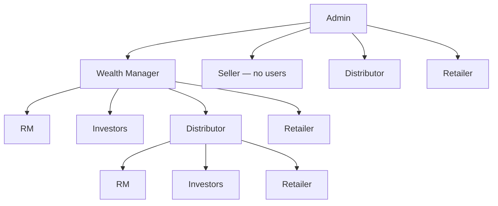

# Actors hub — New system

**Who is who** for the partner marketplace. Full story: [START-HERE](../START-HERE.md).

---

## Show this first

| Document | Use |
|----------|-----|
| [START-HERE](../START-HERE.md) | Whole story |
| [Diagrams](../diagrams/README.md) | Swimlane · Use Case · Flowchart |
| [Hierarchy](../workflows/flows/wm-create-seller-distributor.md) | Channel partner + RM trees |

---

## Two kinds + Seller

| Kind | Roles |
|------|--------|
| **Channel partner** | Wealth Manager, Distributor, Retailer |
| **RM** | Relation Manager — company data + assign investors (for WM / Distributor) |
| **Seller** | Inventory only — **no users below** |

---

## Who is who

| Role | In plain language |
|------|-------------------|
| **Admin** | Creates WM, Seller, Distributor, Retailer. Monitors. |
| **Wealth Manager** | Channel partner. Creates Distributor, Retailer, own investors, **RM**. **Cannot create Seller.** |
| **Seller** | Admin only. Companies / prices / deals. **Cannot create any other user.** |
| **Distributor** | Admin **or** WM. Own investors, retailers, **RM**. |
| **Retailer** | Admin **or** WM **or** Distributor. **Own investors only.** |
| **RM** | Under WM or Distributor. Manages **company data**; **assigns investors**. |
| **Investor** | Owned by WM, Distributor, or Retailer (never Seller). |

---

## Detail pages

| Topic | Link |
|-------|------|
| Hierarchy + RM | [Open](../workflows/flows/wm-create-seller-distributor.md) |
| Register company | [Open](../workflows/flows/seller-register-company.md) |
| Prices and deals | [Open](../workflows/flows/seller-prices-and-deals.md) |
| Home and Hot deals | [Open](../workflows/flows/partner-discovers-company.md) |
| Create investor | [Open](../workflows/flows/partner-create-investor.md) |
| Invest + deal slip | [Open](../workflows/flows/partner-invest-for-investor.md) |
| Order complete | [Open](../workflows/flows/order-to-complete.md) |
| Sell request | [Open](../workflows/flows/partner-sell-request.md) |

---

## More detail

- [Partner module](../modules/partner-business.md)  
- [Partner database](../database/partner.md)  
- [Docs index](../../README.md)

---

## Current vs target

**Target:** WM cannot create Seller; Seller creates no users; RM under WM/Distributor for company data + investor assignment; Distributor/Retailer creatable by Admin or channel.  
**Code later.**
