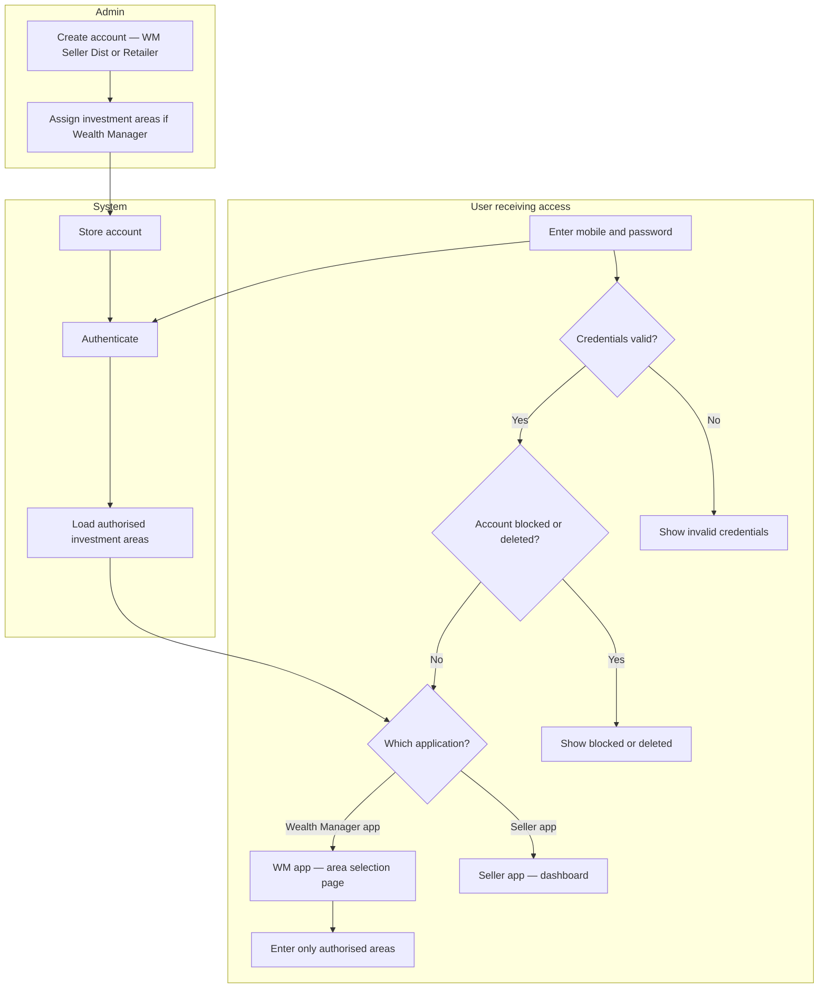

# Swimlane A — Admin creates account → login → authorised access

**Participants:** Admin · User receiving access · System  

Editable PlantUML: [../plantuml/swimlane-A.puml](../plantuml/swimlane-A.puml)

---

## Confirmed behaviour

- Admin creates Wealth Manager, Seller, Distributor, or Retailer (not Investor/RM in this scope).  
- Login: mobile + password.  
- Success: **no** onboarding / profile / KYC gate in this proposed flow.  
- WM-app users: always **investment-area selection** after login (even if one area).  
- Seller: **dashboard** after login.  
- Failures: invalid credentials; blocked/deleted account.  
- No mandatory password change in this flow.  
- Credential delivery and mandatory create fields: **unconfirmed** (not shown as invented steps).

---

## Diagram (Mermaid swimlane-style)

---

## PlantUML

See [../plantuml/swimlane-A.puml](../plantuml/swimlane-A.puml)
