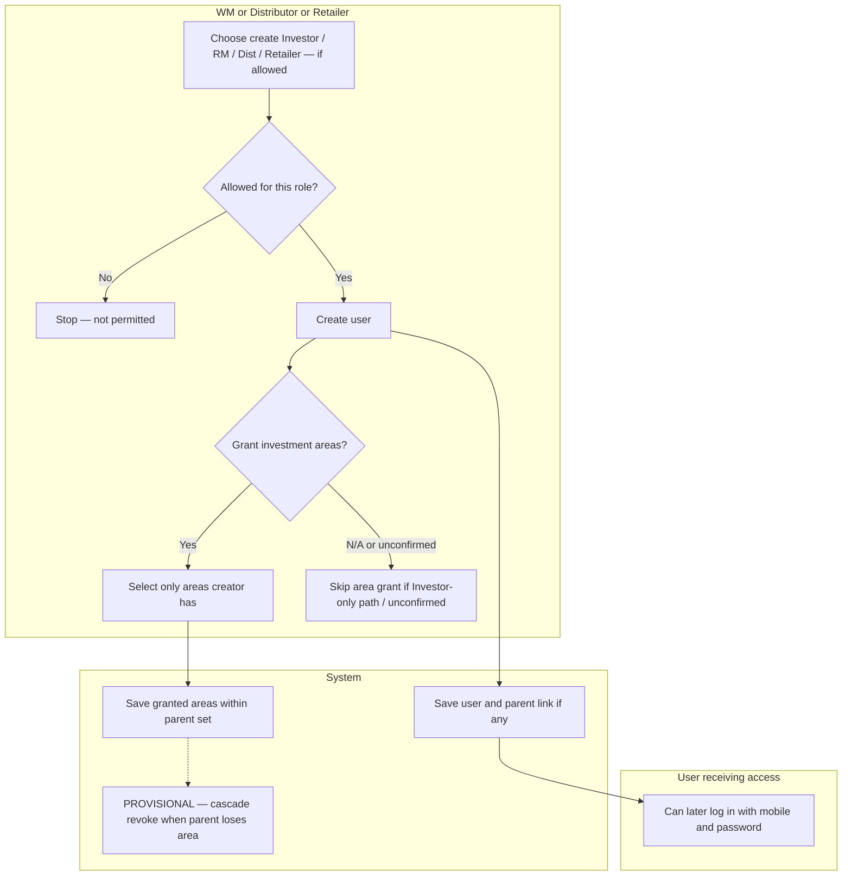

# Swimlane B — Channel partner creates allowed user and grants access

**Participants:** Wealth Manager / Distributor / Retailer (creator) · User receiving access · System  

Editable PlantUML: [../plantuml/swimlane-B.puml](../plantuml/swimlane-B.puml)

---

## Confirmed behaviour

| Creator | May create |
|---------|------------|
| Wealth Manager | Investor, Relationship Manager, Distributor, Retailer |
| Distributor | Retailer, Investor, Relationship Manager |
| Retailer | Investor only |

- Parent may grant subordinate **all or subset** of parent’s enabled investment areas.  
- Parent **cannot** grant an area it does not have.  
- **Provisional:** removing an area from parent removes it from affected subordinates.  
- Independent Dist/Retailer access setup: **unconfirmed**.

---

## Diagram

---

## PlantUML

See [../plantuml/swimlane-B.puml](../plantuml/swimlane-B.puml)
