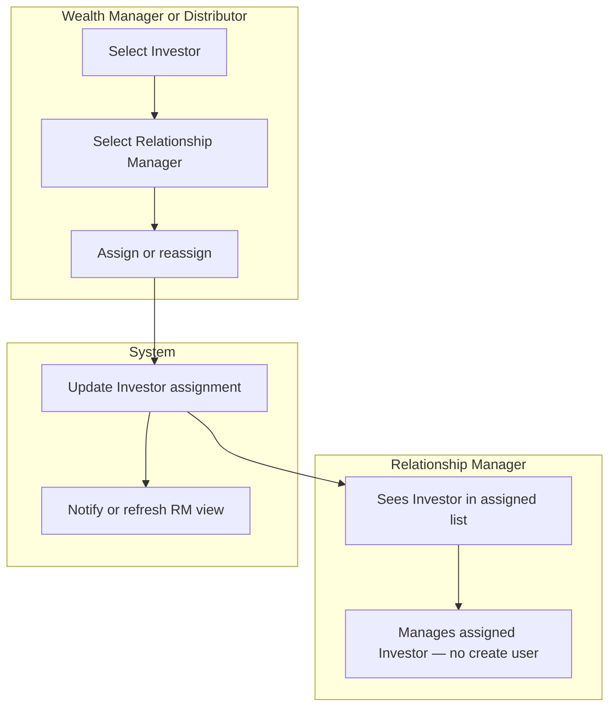

# Swimlane C — Assign / reassign Investors to Relationship Manager

**Participants:** Wealth Manager or Distributor · Relationship Manager · System  

Editable PlantUML: [../plantuml/swimlane-C.puml](../plantuml/swimlane-C.puml)

---

## Confirmed behaviour

- WM and Distributor can **assign** or **reassign** Investors to a Relationship Manager.  
- RM **cannot** create Investors; manages **assigned** Investors.  
- Retailer assignment permissions: **unconfirmed** — not shown as allowed.

---

## Diagram

---

## PlantUML

See [../plantuml/swimlane-C.puml](../plantuml/swimlane-C.puml)
