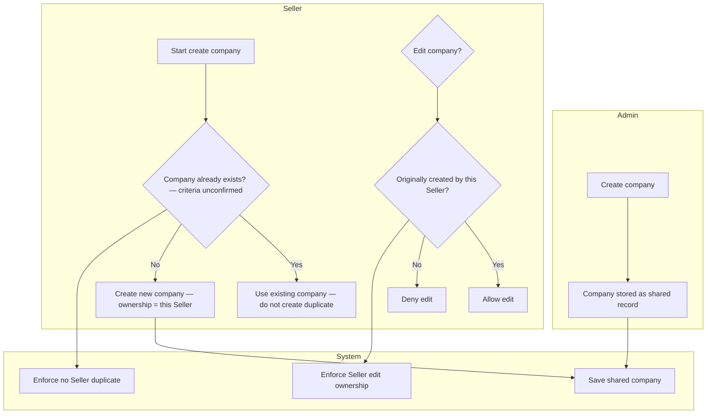

# Swimlane D — Admin or Seller creates a company

**Participants:** Admin · Seller · System  

Shared company records (same companies in both applications).

Editable PlantUML: [../plantuml/swimlane-D.puml](../plantuml/swimlane-D.puml)

---

## Confirmed behaviour

- Admin and Seller can create companies.  
- Seller: if company already exists → **use existing**; **no duplicate**.  
- Seller can **edit only** companies it originally created (not Admin’s or another Seller’s).  
- Duplicate-matching criteria and required fields: **unconfirmed**.  
- Admin edit permissions: **unconfirmed** — not invented.

---

## Diagram

---

## PlantUML

See [../plantuml/swimlane-D.puml](../plantuml/swimlane-D.puml)
