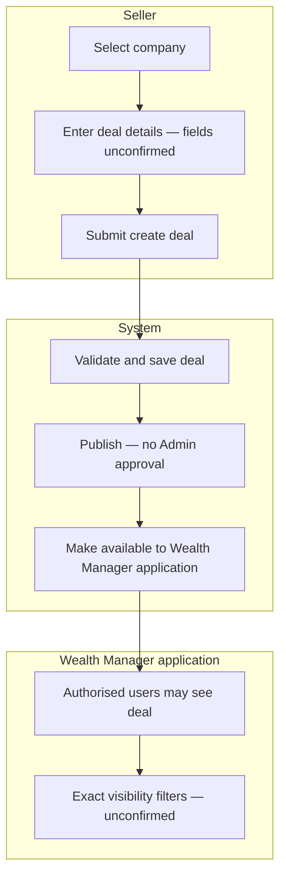

# Swimlane E — Seller creates a deal → available in Wealth Manager

**Participants:** Seller · System · Wealth Manager app users (consume)

Editable PlantUML: [../plantuml/swimlane-E.puml](../plantuml/swimlane-E.puml)

---

## Confirmed behaviour

- Seller creates a deal associated with a company.  
- After success, deal appears in Wealth Manager.  
- **No Admin approval** for publication.  
- Required fields, edit rules, lifecycle statuses: **unconfirmed**.  
- Area access does **not** automatically mean every deal is visible — further visibility rules **unconfirmed**.

---

## Diagram

---

## PlantUML

See [../plantuml/swimlane-E.puml](../plantuml/swimlane-E.puml)
