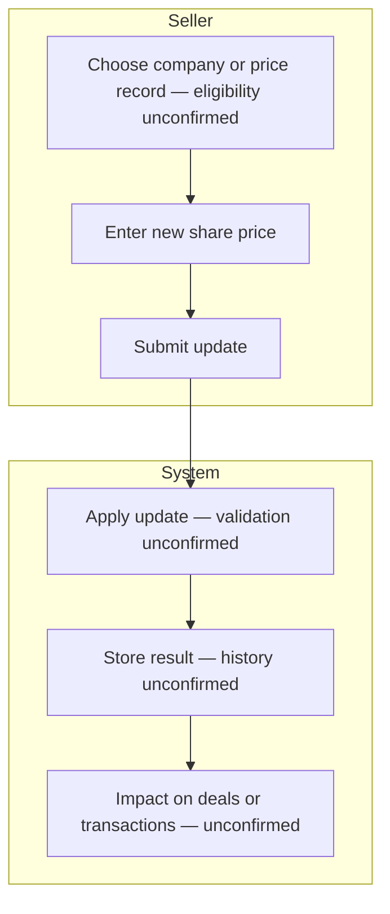

# Swimlane F — Seller updates a share price (high level)

**Participants:** Seller · System  

Editable PlantUML: [../plantuml/swimlane-F.puml](../plantuml/swimlane-F.puml)

---

## Confirmed behaviour

- Seller **can** update share prices.  

## Unconfirmed (do not invent)

- Eligible records / ownership restrictions  
- Validation rules  
- Price history  
- Effect on existing deals or transactions  
- Do **not** infer share-price rights from company-edit rights  

---

## Diagram

---

## PlantUML

See [../plantuml/swimlane-F.puml](../plantuml/swimlane-F.puml)
