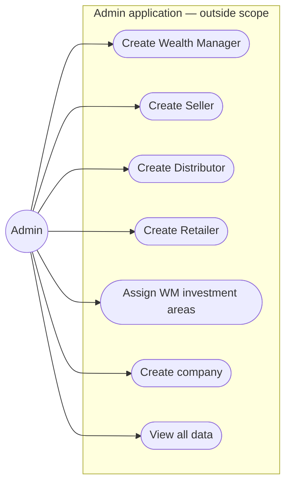
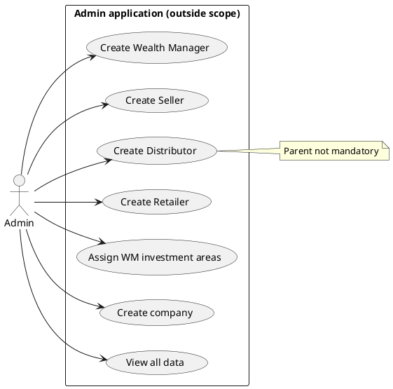

# Use cases — Admin

Admin is an **external supporting actor**. The Admin application is outside this project’s available scope. Admin can **view all data**.

Editable PlantUML: [../plantuml/use-case-admin.puml](../plantuml/use-case-admin.puml)

---

## Diagram (Mermaid)

---

## Responsibilities (confirmed)

| Use case | Notes |
|----------|--------|
| Create Wealth Manager | Yes |
| Create Seller | Yes |
| Create Distributor | Yes — parent **not** mandatory |
| Create Retailer | Yes — parent **not** mandatory |
| Assign WM investment areas | Primary / LP Secondary / Unlisted — one, two, or all |
| Create company | Shared company records |
| View all data | Yes |

**Out of current Admin scope:** create Investors; create Relationship Managers.

---

## PlantUML source

