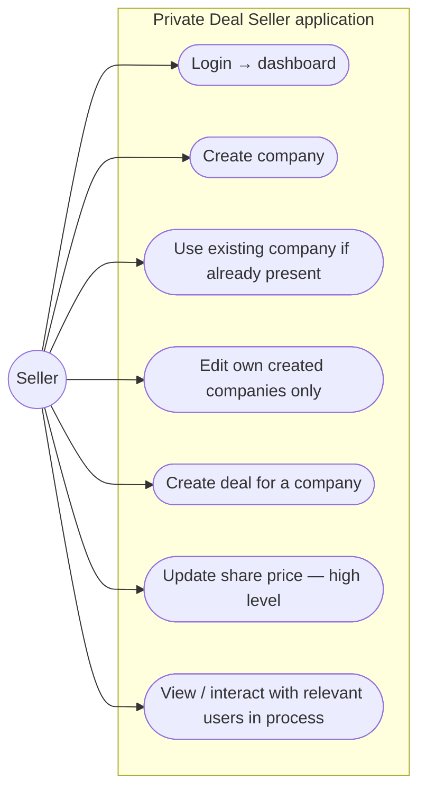
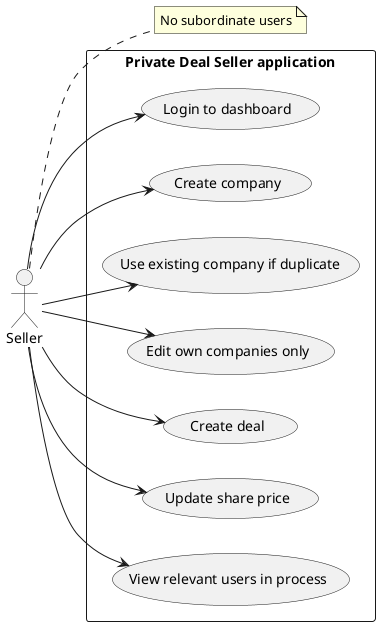

# Use cases — Private Deal Seller

Private Deal Seller application. Seller has **no subordinate users or roles**.

Editable PlantUML: [../plantuml/use-case-seller.puml](../plantuml/use-case-seller.puml)

---

## Diagram (Mermaid)

---

## Responsibilities (confirmed)

| Use case | Notes |
|----------|--------|
| Login → dashboard | No area-selection page (unlike WM app) |
| Create company | Shared records; no duplicate if exists |
| Edit company | **Only** companies this Seller originally created |
| Create deal | No Admin approval; available in Wealth Manager |
| Update share price | High-level; detailed rules unconfirmed |
| View/interact users | During business process only — **no** account create/manage |

**Cannot:** create or manage user accounts / roles.

---

## PlantUML source

