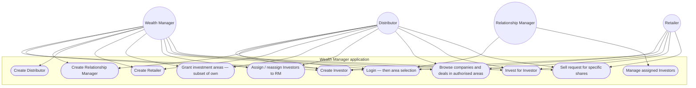
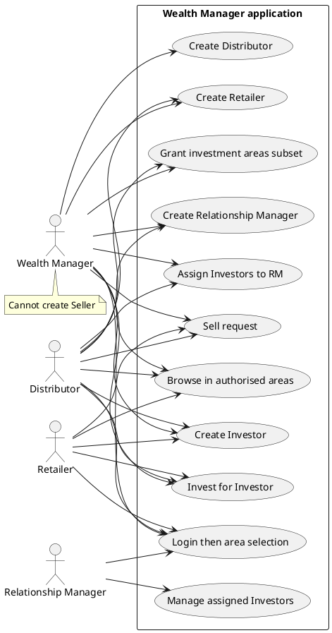

# Use cases — Wealth Manager and related roles

Wealth Manager application. Related roles: Distributor, Retailer, Relationship Manager, Investor (as managed record).

Editable PlantUML: [../plantuml/use-case-wealth-manager.puml](../plantuml/use-case-wealth-manager.puml)

---

## Diagram (Mermaid)

---

## Who creates whom (confirmed)

| Actor | Creates |
|-------|---------|
| Wealth Manager | Investors, Relationship Managers, Distributors, Retailers |
| Distributor | Retailers, Investors, Relationship Managers |
| Retailer | Investors |
| Relationship Manager | **Nobody** — manages **assigned** Investors only |

WM **cannot** create Seller.

---

## Investment areas

Access permissions (not roles): Primary Startup (PE) · Secondary Startup (LP Secondary) · PRE-IPO (Unlisted).

- Admin assigns WM’s areas.  
- Parent grants subordinates only areas the parent has.  
- **Provisional:** removing an area from parent cascades to subordinates.

---

## PlantUML source

