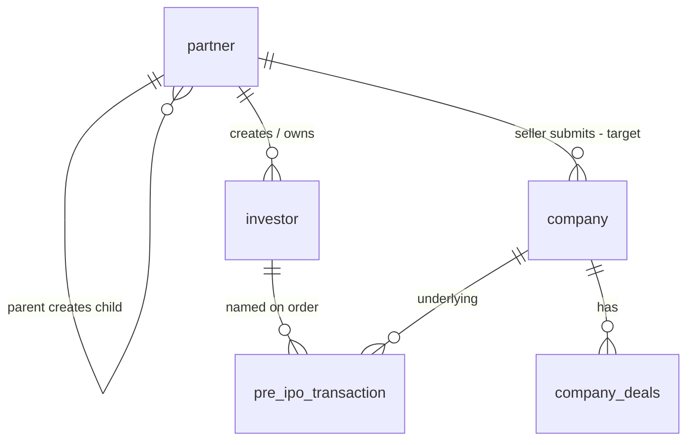

# Database: Partner network

**In one sentence:** Partners (including the target **Seller** role) live on the `partner` table; investors created by partners point back with `partner_id`.

> **Stakeholders:** use the diagram below.  
> **Technical columns** are listed after.

---

## Relationship picture

**Plain language:**

- **Admin** can create **Wealth Manager** or **Seller** (Seller like WM).  
- **Wealth Manager** creates Seller / Distributor / Retailer and has **own investors**.  
- **Seller** (Admin-created or under WM) can have **Distributor** and **Retailer** below, but **no own investors**.  
- **Distributor** (under WM or Seller) has **own investors** and **own retailers**.  
- **Retailer** (under WM, Seller, or Distributor) has **own investors** only.  
- Seller registers companies and uploads prices/deals (multi selling companies, multi bank/demat; select selling company on deal).  
- When WM/Distributor/Retailer invests, the **deal slip** carries that transaction’s **bank and demat**.  
- **LP Secondary** uses the same invest → deal slip → complete path as Pre-IPO / unlisted.

---

## Partner types (target)

| Type | Meaning |
|------|---------|
| Wealth Manager | Created by **Admin**. Creates Seller, Distributor, Retailer; **own investors** |
| Seller | Created by **Admin** or under WM. Has Distributor + Retailer. **No own investors** |
| Distributor | Under WM **or** Seller. **Own investors** + **own retailers** |
| Retailer | Under WM, Seller, or Distributor. **Own investors** only |

---

## Important fields (partner)

| Area | Examples |
|------|----------|
| Identity | name, mobile, email, uuid |
| Role | `type` (includes **seller** in target model) |
| Hierarchy | `parent_id`, `parent_type` |
| Access | product access flags (primary / secondary / pre-ipo style) |
| Status | active / blocked / demo style flags |

**Investor (as partner-owned record only):** `partner_id` links the investor to the creating partner. Full investor schema is not expanded in this stakeholder pack.

---

## Related tables sellers care about

| Table / concept | Role |
|-----------------|------|
| `company` | Created by seller; live on create; duplicate check |
| Selling companies under seller | Multiple companies that sell shares |
| Bank / demat accounts (seller) | Multiple accounts; chosen for deal / transaction |
| Share price / seller quotes | Prices uploaded by Seller |
| `company_deals` | Deals (and hot/other deals); **select selling company** on create |
| Investment transaction | Order; deal slip shows **bank + demat** at transaction level |
| Enquiries / sell requests | Partner sell request for specific shares |

---

## Current vs target

| Topic | Target (docs) | Current code (until migration) |
|-------|---------------|--------------------------------|
| Seller identity | Row on `partner` with type Seller | Often `seller_master` |
| WM creates Seller | Allowed | Not in `PartnerTypeEnum` yet |
| Company submit | Seller partner | Seller API / `submitted_by_seller_id` toward seller master |

---

## Related

- [Actors hub](../actors/README.md)  
- [Whole project flow](../workflows/whole-project-flow.md)  
- [Partner module](../modules/partner-business.md)  
- [Database overview](../../database/overview.md)  
- [START-HERE](../START-HERE.md)  
- [Diagrams](../diagrams/README.md)

---

## For technical team

Model: `app/Models/PartnerModel.php`. Enum today: `app/Enums/PartnerTypeEnum.php` (no `seller` case yet). Investor: `InvestorModel.partner_id`.
