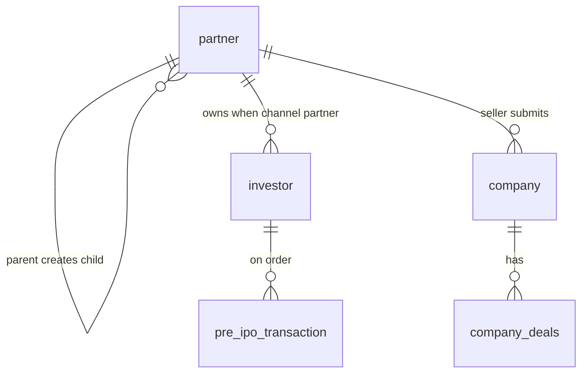

# Database: Partner network (new system)

**Stakeholders:** diagram + roles below.  
**Start:** [START-HERE](../START-HERE.md)

---

## Relationship picture

---

## Roles (target)

| Type | Kind | Created by | Own investors | Notes |
|------|------|------------|---------------|--------|
| Wealth Manager | Channel partner | Admin | Yes | Inv, Relationship Manager, Dist, Retailer. **Not Seller** |
| Seller | Inventory | Admin | No | **No child users** |
| Distributor | Channel partner | Admin or WM | Yes | Retailers + Relationship Manager |
| Retailer | Channel partner | Admin, WM, or Distributor | Yes | Investors only |
| Relationship Manager | RM | WM or Distributor | Assigned only | Manages assigned Investors |

---

## Plain rules

- Admin creates WM, Seller, Distributor, Retailer  
- WM **cannot** create Seller  
- Seller **cannot** create any user  
- RM under WM/Distributor for company data and investor assignment  
- Investors only under WM / Distributor / Retailer  

---

## Related tables (seller commercial)

| Concept | Role |
|---------|------|
| company | Seller create; live; duplicate check |
| bank / demat | Multiple; on deal / transaction |
| company_deals | Select selling company |
| investment transaction | Deal slip bank + demat |

---

## Related

- [Hierarchy](../workflows/flows/wm-create-seller-distributor.md)
- [Actors](../actors/README.md)
- [Database overview](../../database/overview.md)
- [Diagrams](../diagrams/README.md)
