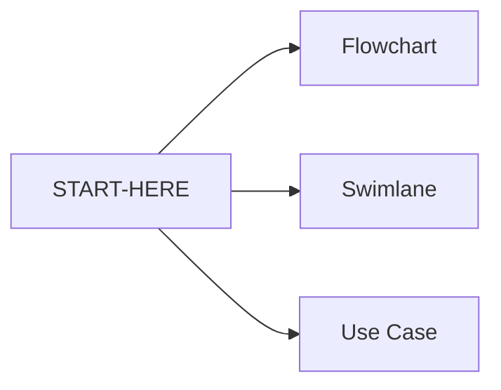

# Diagrams — New system

**Folder:** `docs/new-system/diagrams/`  

Three diagram types for stakeholders and product reviews. Start from [START-HERE](../START-HERE.md).

| Diagram | What it shows | Open |
|---------|---------------|------|
| **Flowchart** | End-to-end process path | [flowchart.md](flowchart.md) |
| **Swimlane activity** | Who does what, by role (lanes) | [swimlane-activity.md](swimlane-activity.md) |
| **Use case** | Actors and what they can do in the system | [use-case.md](use-case.md) |

