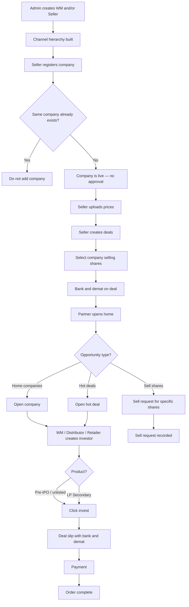
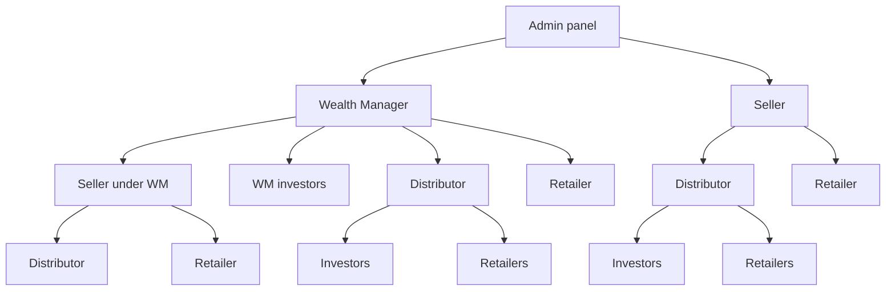

# Flowchart — New system (whole marketplace)

**Type:** Flowchart  
**Purpose:** One picture of how work moves from setup → seller inventory → partner invest / sell → complete.

Back to: [Diagrams index](README.md) · [START-HERE](../START-HERE.md)

---

## Main flowchart

---

## Hierarchy flowchart

---

## Related detail pages

- [Whole story](../START-HERE.md)
- [Hierarchy](../workflows/flows/wm-create-seller-distributor.md)
- [Register company](../workflows/flows/seller-register-company.md)
- [Prices and deals](../workflows/flows/seller-prices-and-deals.md)
- [Invest](../workflows/flows/partner-invest-for-investor.md)
