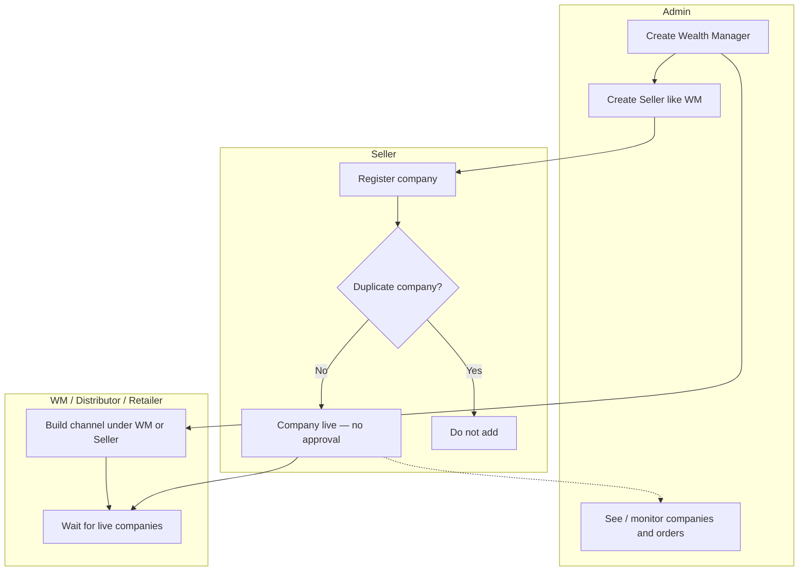
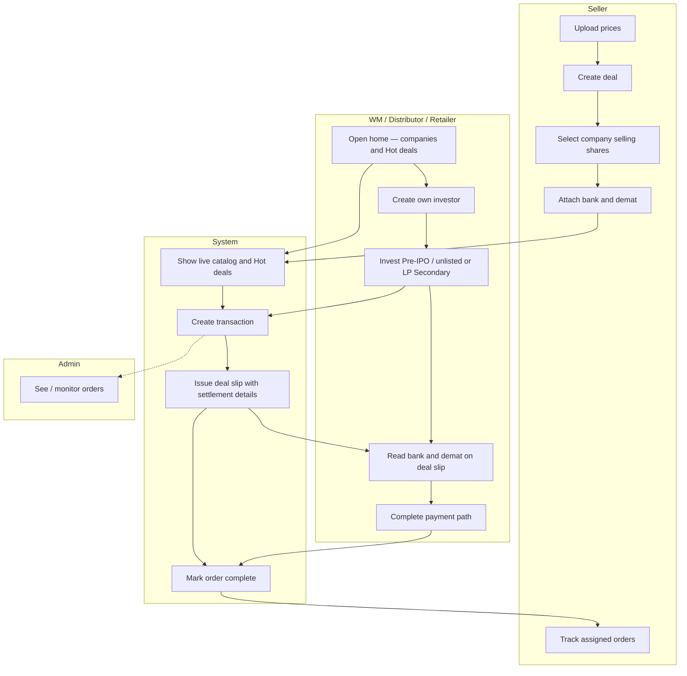
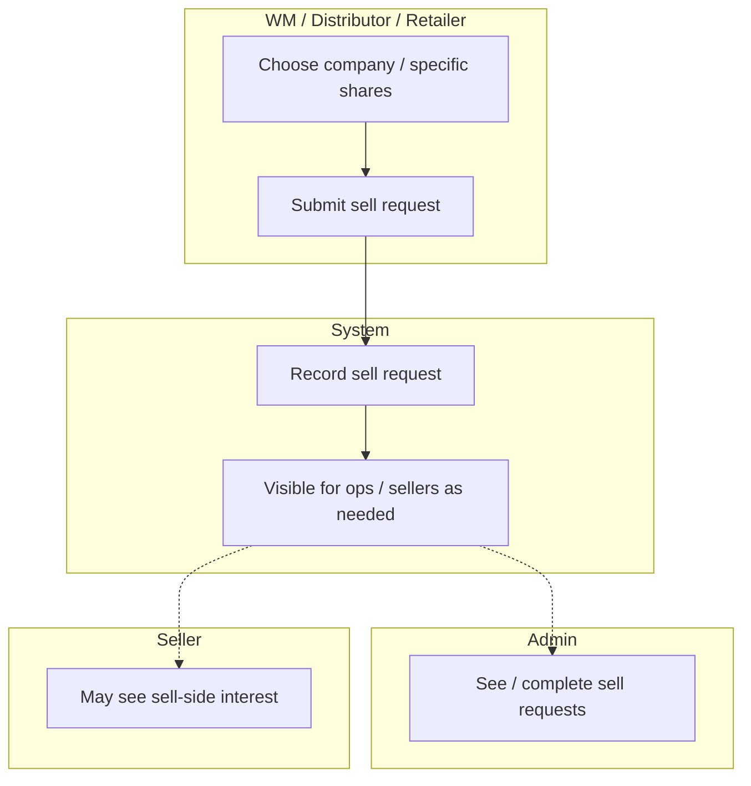

# Swimlane activity diagram — New system

**Type:** Swimlane (activity by role)  
**Purpose:** Show **who** does each activity across Admin, Seller, WM / Distributor / Retailer, and the System.

Back to: [Diagrams index](README.md) · [START-HERE](../START-HERE.md)

---

## Swimlane — Setup to company live

---

## Swimlane — Prices, deals, invest, deal slip

---

## Swimlane — Sell request (branch)

---

## How to read this

| Lane | Meaning |
|------|---------|
| **Admin** | Creates WM/Seller; monitors |
| **Seller** | Companies, prices, deals, settlement accounts; no own investors |
| **WM / Distributor / Retailer** | Channel partners who create investors and invest (or sell-request) |
| **System** | Catalog, transaction, deal slip, completion |

---

## Related

- [Flowchart](flowchart.md)
- [Use case](use-case.md)
- [START-HERE](../START-HERE.md)
