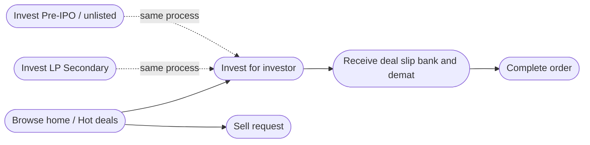

# Use case diagram — New system

**Type:** Use case  
**Purpose:** Show **actors** and **what they can do** in the new partner marketplace system.

Back to: [Diagrams index](README.md) · [START-HERE](../START-HERE.md)

---

## Use case overview

```mermaid
flowchart TB
  subgraph Actors [Actors]
    Admin((Admin))
    WM((Wealth Manager))
    Seller((Seller))
    Dist((Distributor))
    Ret((Retailer))
  end

  subgraph System [New system — Partner marketplace]
    UC1([Create WM / Seller])
    UC2([Manage channel hierarchy])
    UC3([Register company])
    UC4([Upload prices])
    UC5([Create deals — select selling company])
    UC6([Manage bank and demat accounts])
    UC7([Browse home and Hot deals])
    UC8([Create investor])
    UC9([Invest Pre-IPO / unlisted])
    UC10([Invest LP Secondary])
    UC11([Receive deal slip bank and demat])
    UC12([Complete order])
    UC13([Sell request for specific shares])
    UC14([Monitor companies and orders])
  end

  Admin --> UC1
  Admin --> UC14
  WM --> UC2
  WM --> UC7
  WM --> UC8
  WM --> UC9
  WM --> UC10
  WM --> UC11
  WM --> UC12
  WM --> UC13
  Seller --> UC2
  Seller --> UC3
  Seller --> UC4
  Seller --> UC5
  Seller --> UC6
  Dist --> UC2
  Dist --> UC7
  Dist --> UC8
  Dist --> UC9
  Dist --> UC10
  Dist --> UC11
  Dist --> UC12
  Dist --> UC13
  Ret --> UC7
  Ret --> UC8
  Ret --> UC9
  Ret --> UC10
  Ret --> UC11
  Ret --> UC12
  Ret --> UC13
```

---

## Use cases by actor

### Admin
| Use case | Notes |
|----------|--------|
| Create WM / Seller | Same admin panel idea for both |
| Monitor companies and orders | See only — not company approval gate |

### Wealth Manager
| Use case | Notes |
|----------|--------|
| Manage channel hierarchy | Seller, Distributor, Retailer; own investors |
| Browse home / Hot deals | |
| Create investor | Own investors |
| Invest Pre-IPO / unlisted or LP Secondary | Same process |
| Receive deal slip (bank + demat) | Transaction level |
| Complete order | |
| Sell request | Specific shares |

### Seller
| Use case | Notes |
|----------|--------|
| Manage channel under Seller | Distributor + Retailer (**no** own investors) |
| Register company | Live immediately; block duplicates |
| Upload prices | |
| Create deals | Must select company selling shares |
| Manage bank / demat | Multiple accounts |

### Distributor
| Use case | Notes |
|----------|--------|
| Manage own retailers + own investors | Under WM or Seller |
| Browse, create investor, invest, deal slip, complete, sell request | Same as WM invest path |

### Retailer
| Use case | Notes |
|----------|--------|
| Own investors only | Under WM, Seller, or Distributor |
| Browse, create investor, invest, deal slip, complete, sell request | Same invest path |

---

## Include / extend (simple)

---

## Related

- [Swimlane activity](swimlane-activity.md)
- [Flowchart](flowchart.md)
- [Actors hub](../actors/README.md)
- [START-HERE](../START-HERE.md)
