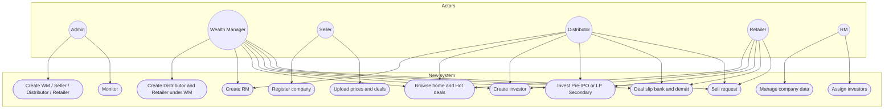

# Use case diagram — New system

**Type:** Use case  
Back to: [Diagrams](README.md) · [START-HERE](../START-HERE.md)

---

## Use case overview

---

## By actor

| Actor | Use cases |
|-------|-----------|
| Admin | Create WM, Seller, Distributor, Retailer; monitor |
| WM | Channel (Distributor, Retailer, RM, investors); browse; invest; sell request. **Not** create Seller |
| Seller | Register company; prices/deals. **No** create users |
| Distributor | Retailers, RM, investors; invest path |
| Retailer | Investors only; invest path |
| RM | Company data; assign investors for WM/Distributor |

---

## Related

- [Swimlane](swimlane-activity.md) · [Flowchart](flowchart.md) · [Hierarchy](../workflows/flows/wm-create-seller-distributor.md)
