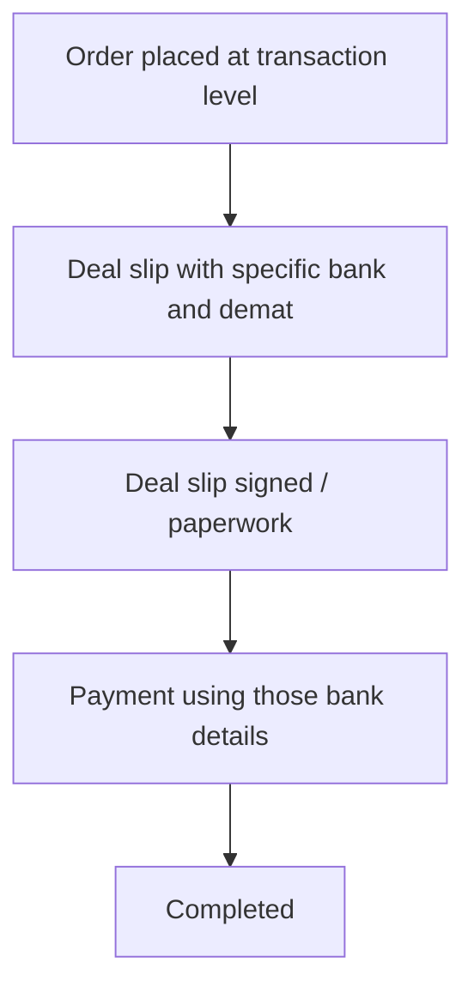

# Flow H — Order completes (deal slip → payment)

**In one sentence:** After invest, the **deal slip** carries the **transaction-level bank and demat** for that deal; then paperwork, payment, and completion follow — the same pattern for **Pre-IPO / unlisted** and **LP Secondary**.

## Who is involved

| Role | What they do |
|------|----------------|
| Wealth Manager / Distributor / Retailer | Uses deal slip (bank + demat) for their investor’s order |
| Seller | Tracks the order; accounts came from their deal setup; does not own the investor |
| Admin | Can see order progress |
| Investor (record) | Ends with completed investment / portfolio impact |

## Flowchart

## Steps

1. **What happens:** Order is confirmed / advanced after invest.  
   **Result:** Transaction is tied to the deal (selling company + settlement accounts).

2. **What happens:** **Deal slip** is issued with the **specific bank detail and demat detail** for this transaction.  
   **Result:** WM / Distributor (and investor path) know exactly where to pay and which demat context applies.

3. **What happens:** Deal slip / paperwork is completed (e.g. signed).  
   **Result:** Documentation step done.

4. **What happens:** Payment is recorded against those instructions.  
   **Result:** Settlement progresses.

5. **What happens:** Order is marked **complete**.  
   **Result:** Investment finished; portfolio updated where applicable.

## Rules to remember

| Rule | Meaning |
|------|---------|
| **Transaction level** | Bank and demat on the slip are for **this** order/deal, not a generic seller profile only. |
| **Same for LP Secondary** | Completion path matches Pre-IPO / unlisted. |

## When this flow ends

The marketplace path for this company → investor order is **done**.

## Back to the big picture

→ [Whole project flow](../whole-project-flow.md)

## Related

- Previous: [Partner invests for that investor](partner-invest-for-investor.md)  
- Seller setup: [Seller prices & deals](seller-prices-and-deals.md)

---

## For technical team

Target: persist bank/demat (or FKs) on the transaction / deal-slip artifact at create/confirm time from the selected deal’s selling company accounts. Current Digio deal-slip path may need extension when multi-account model ships.
