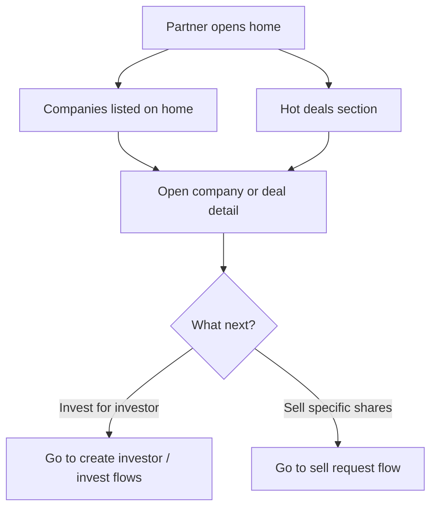

# Flow E — Partner sees opportunities (Home & Hot deals)

**In one sentence:** On the Partner home, the Partner can browse **companies listed on the home page** and **Hot deals**, then open any opportunity to act.

## Who is involved

| Role | What they do |
|------|----------------|
| Partner | Browses home companies and Hot deals; may invest later or make a sell request |
| Seller | Provides companies / deals that appear when live |
| Admin | Can see marketplace activity |

## Flowchart

## Steps

1. **What happens:** Partner opens the business **home** page.  
   **Result:** They see marketplace opportunities in more than one place.

2. **What happens:** Partner browses **companies listed on the home page** (Pre-IPO / unlisted and **LP Secondary** as shown).  
   **Result:** Partner can open a company and later invest for an investor (same invest process for LP Secondary).

3. **What happens:** Partner browses **Hot deals** on the same home experience.  
   **Result:** Highlighted deals are visible; partner can open a hot deal and later invest.

4. **What happens:** Partner may choose to **sell specific shares** instead of buying (see sell-request flow).  
   **Result:** Path splits to sell request for a chosen company/shares.

## Partner opportunity types (at a glance)

| Type | Where | Typical next step |
|------|--------|-------------------|
| Companies on home | Home page listings | Invest for an investor |
| Hot deals | Home → Hot deals | Invest for an investor (often tied to a deal) |
| Sell request | From a company / shares the partner wants to sell | [Sell request flow](partner-sell-request.md) |

## When this flow ends

Partner has found an opportunity on **home** or **Hot deals** (or decided to raise a sell request).

## Next flows

→ [Partner creates an investor](partner-create-investor.md) (before investing)  
→ [Partner invests for that investor](partner-invest-for-investor.md)  
→ [Partner sell request for specific shares](partner-sell-request.md)

## Related

- [Whole project flow](../whole-project-flow.md)  
- Previous: [Seller sets prices and deals](seller-prices-and-deals.md)

---

## For technical team

Business V2 `GET /api/v2/business/home/pre-ipo` returns home company buckets plus `data.hot_deals` (unlisted companies with hot non-expired deals). Company list/detail also available. Stakeholder “listed on home” = companies shown on partner home, not exchange-listed stocks.
