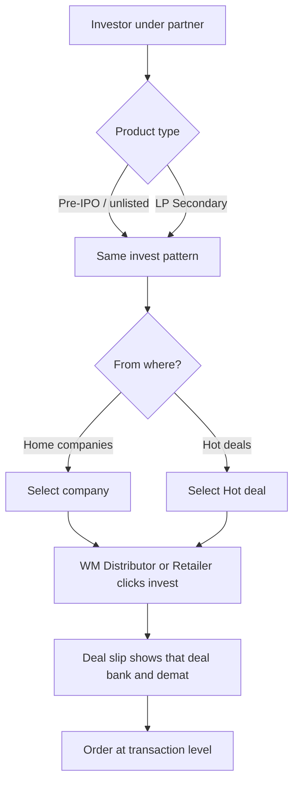

# Flow G — Partner invests for that investor

**In one sentence:** Wealth Manager, Distributor, or Retailer invests **for their investor** from **home companies** or **Hot deals**. The investment flow is the **same** for **Pre-IPO / unlisted** and for **LP Secondary**. On invest, they get the deal’s **specific bank and demat** on the **deal slip** (transaction level).

## Who is involved

| Role | What they do |
|------|----------------|
| Wealth Manager / Distributor / Retailer | Chooses opportunity and places the buy for their investor |
| Seller | Provided the deal (selling company + bank/demat); does **not** invest |
| Investor (record) | Named on the order |
| Admin | Can see orders |

## Flowchart

## Steps

1. **What happens:** Partner already has an investor ([Flow F](partner-create-investor.md)).  
   **Result:** Buy will be for that investor.

2. **What happens:** Partner chooses product type — **Pre-IPO / unlisted** or **LP Secondary**.  
   **Result:** Same invest pattern either way (LP Secondary is not a different “invest process”).

3. **What happens:** Partner invests from **home companies** or from **Hot deals**.  
   **Result:** Company / deal context is selected (including the Seller’s chosen **selling company** on that deal).

4. **What happens:** Wealth Manager, Distributor, or Retailer **clicks invest**.  
   **Result:** Order is created at **transaction level**.

5. **What happens:** They receive the **specific bank detail and demat detail** for that deal on the **deal slip**.  
   **Result:** Payment / demat instructions match the selling company / accounts selected when the Seller created the deal — not a random seller default.

## Invest types (partner)

| Invest from | Product labels | Same process? |
|-------------|----------------|---------------|
| Home — companies | Pre-IPO / unlisted, **LP Secondary** | Yes — same invest flow |
| Hot deals | Pre-IPO / unlisted, **LP Secondary** | Yes — same invest flow |

**Sell request** (offering specific shares) is separate → [Flow I](partner-sell-request.md).

## Naming note

| Stakeholder term | Meaning in this docs set |
|------------------|--------------------------|
| **LP Secondary** | Secondary-style opportunity; **invest works like** Pre-IPO / unlisted |
| Pre-IPO / unlisted | Unlisted / Pre-IPO opportunity |

## When this flow ends

An investment **order** exists with deal-slip settlement details (bank + demat) for that transaction.

## Next flow

→ [Order completes](order-to-complete.md)

## Related

- [Seller prices & deals](seller-prices-and-deals.md) — selling company + accounts  
- [Partner home & Hot deals](partner-discovers-company.md)  
- [Whole project flow](../whole-project-flow.md)

---

## For technical team

Target: deal slip / transaction payload must include bank + demat resolved from the deal’s selling company / selected accounts. LP Secondary should reuse the same partner invest → deal slip → complete path as Pre-IPO/unlisted (product naming), even if `company.type` or API home routes differ (`home/pre-ipo` vs `home/secondary`) in current code.
