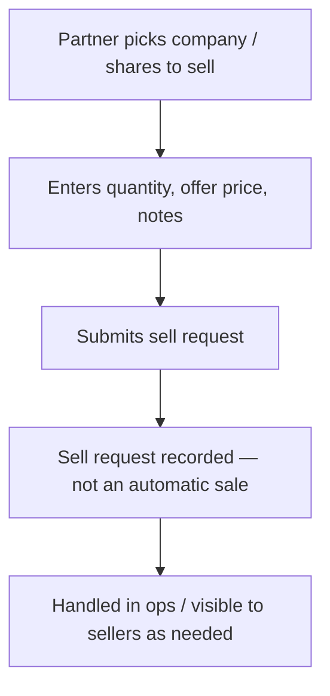

# Flow I — Partner sell request for specific shares

**In one sentence:** The Partner can raise a **sell request** for **specific shares** (a chosen company / quantity / offer), separate from investing on home or Hot deals.

## Who is involved

| Role | What they do |
|------|----------------|
| Partner | Creates a sell request for specific shares |
| Seller | Can see sell-side interest (sell enquiries) where applicable |
| Admin | Can see / complete sell requests or enquiries |

## Flowchart

## Steps

1. **What happens:** Partner chooses the **company** and the **specific shares** they want to sell (quantity and offer details).  
   **Result:** Sell intent is clear (not a buy from home / Hot deals).

2. **What happens:** Partner submits a **sell request** (sell enquiry).  
   **Result:** Request is recorded. This does **not** instantly complete a sale or create a buy order.

3. **What happens:** Admin / ops (and seller views of sell enquiries) can see the request.  
   **Result:** Follow-up is operational — not auto-matched in this product story.

## How this differs from investing

| Action | Flow |
|--------|------|
| Invest from **home companies** | [Flow G](partner-invest-for-investor.md) |
| Invest from **Hot deals** | [Flow G](partner-invest-for-investor.md) |
| **Sell request** for specific shares | **This flow (I)** |

## When this flow ends

A sell request for specific shares exists and can be tracked / completed by ops.

## Related

- [Whole project flow](../whole-project-flow.md)  
- [Partner sees opportunities](partner-discovers-company.md)  
- Previous discovery: home & hot deals

---

## For technical team

Business V2 `POST /api/v2/business/enquiries/create` with `enquiry_type=sell` (quantity, offer_price, optional deal, notes). Seller V2 lists sell enquiries. Admin company-enquiry screens mark pending → completed. No auto convert-to-order in v1.
