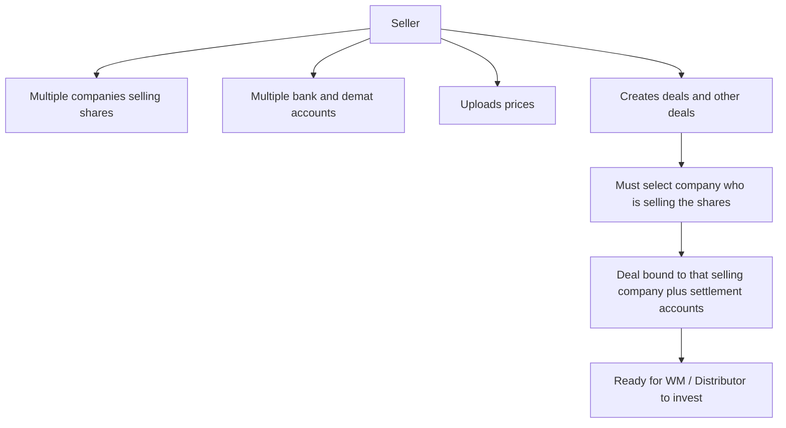

# Flow D — Seller uploads prices, deals & selling-company details

**In one sentence:** The **same Seller** who uploads **prices** also uploads **deals** (and related deal data). A Seller can work with **multiple companies selling shares**, and hold **multiple bank and demat accounts**. When creating a deal, the Seller **must select which company is selling** the shares.

## Who is involved

| Role | What they do |
|------|----------------|
| Seller | Uploads prices, creates deals, maintains bank/demat accounts, picks selling company per deal |
| Wealth Manager / Distributor | Later invest → receive that deal’s bank & demat on the **deal slip** |
| Admin | Can see commercial data |

## Flowchart

## Steps

1. **What happens:** Seller manages **one or more companies** that sell shares (inventory side).  
   **Result:** Multiple selling companies can exist under the same Seller.

2. **What happens:** Seller maintains **multiple bank account** and **demat account** details.  
   **Result:** Settlement options are available to attach when deals / transactions need them.

3. **What happens:** Seller **uploads prices** for companies.  
   **Result:** Partners see pricing context on home / company views.

4. **What happens:** Seller creates a **deal** (including hot deals / other deal types as offered).  
   **Result:** At create time the Seller **must select the company who is selling the shares**.

5. **What happens:** That choice (selling company + the bank/demat used for that deal path) is what partners will see later on the **deal slip** when they invest.  
   **Result:** Settlement details are deal / transaction specific — not a generic seller-wide slip.

## Rules to remember

| Rule | Meaning |
|------|---------|
| **Same Seller uploads prices and deals** | Price upload and deal creation are the Seller’s commercial work. |
| **Multiple selling companies** | One Seller can represent more than one company selling shares. |
| **Multiple bank & demat** | Seller can store several accounts. |
| **Deal create = select selling company** | Required when creating a deal — which company is selling these shares. |
| **Deal slip is transaction-level** | When WM/Distributor invests, the slip shows the **specific** bank and demat for that deal/transaction. |

## When this flow ends

Prices and deals are published; each deal knows **which company is selling**, with settlement accounts ready for invest → deal slip.

## Next flow

→ [Partner sees opportunities (home & Hot deals)](partner-discovers-company.md)

## Related

- [Whole project flow](../whole-project-flow.md)  
- Previous: [Seller registers a company](seller-register-company.md)  
- Invest + deal slip: [Flow G](partner-invest-for-investor.md) · [Flow H](order-to-complete.md)

---

## For technical team

**Target model (docs):** multi company-under-seller, multi bank/demat, mandatory selling-company on deal create, deal-slip carries transaction-specific bank/demat.  
**Current code** may still be simpler (`seller_master`, single demat/bank on seller, `company_deals` without full multi-account selection) — implement later; keep docs as product truth for stakeholders.
