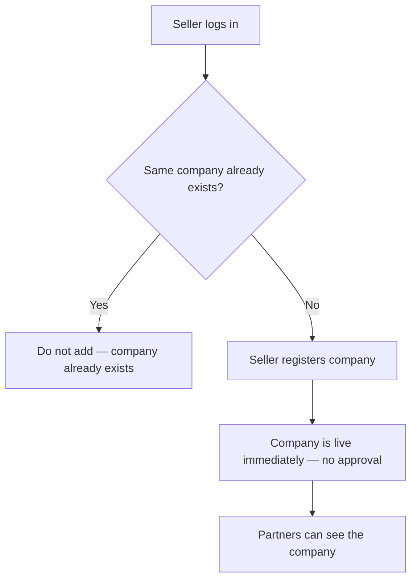

# Flow B — Seller registers a company

**In one sentence:** The Seller adds a company; if it is new, it is available right away — **no approval**. If the same company already exists, it is **not** added again.

## Who is involved

| Role | What they do |
|------|----------------|
| Seller | Registers the company (with duplicate check) |
| Partner | Can see the company once it is successfully created |
| Admin | Can see companies (monitor only) |

## Flowchart

## Steps

1. **What happens:** Seller logs into their workspace.  
   **Result:** Seller is authenticated.

2. **What happens:** System checks whether the **same company already exists** (for example same identity such as CIN / known company record — as implemented).  
   **Result:**  
   - If it **already exists** → **do not add** a new company; seller is told it already exists.  
   - If it is **new** → continue to create.

3. **What happens:** Seller submits company details for a **new** company.  
   **Result:** Company is created and is **live immediately**. There is **no approval step**.

4. **What happens:** Partners can discover the company on business lists/homes.  
   **Result:** Marketplace inventory includes this company without waiting on admin approval.

## Rules to remember

| Rule | Meaning |
|------|---------|
| **No approval** | Seller registration does **not** wait for admin approve to go live. |
| **Duplicate check** | If the same company already exists, **do not create** another copy. |

## When this flow ends

Either the company is **live** for partners, or creation was **blocked** because the company already exists.

## Next flow

→ [Seller sets prices and deals](seller-prices-and-deals.md)

## Related

- [Whole project flow](../whole-project-flow.md)  
- Previous: [Wealth Manager creates Seller](wm-create-seller-distributor.md)  
- Note: [Company goes live](company-goes-live.md) — no longer a separate approval step

---

## For technical team

**Target product rule (these docs):** create without approval gate; enforce duplicate-company validation before insert.  
**Current code** may still use pending approval / `approval_status` — update code later to match; until then living-docs note: **docs describe target**. Seller check-duplicate style APIs may already exist under seller company endpoints — align create flow with that validation.
