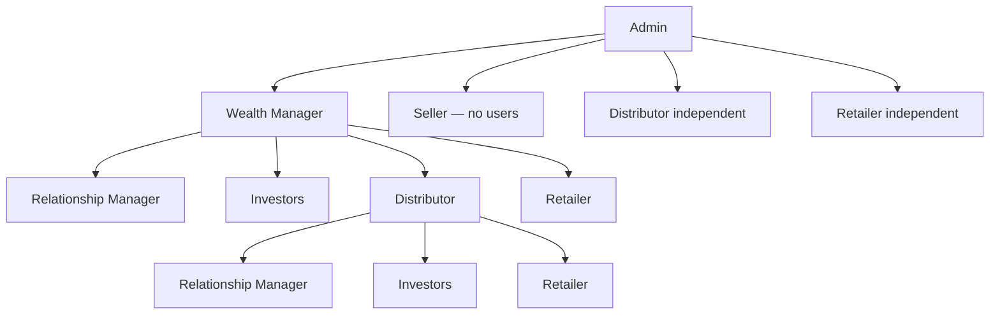

# Channel hierarchy — New system

Aligned with [business-diagrams/role-permissions.md](../business-diagrams/role-permissions.md).  
Uses **Relationship Manager** naming.

---

## Two kinds + Seller

| Kind | Roles |
|------|--------|
| **Channel partner** | Wealth Manager, Distributor, Retailer |
| **Relationship Manager** | Manages **assigned** Investors; company data for WM/Distributor |
| **Seller** | Inventory only — **no subordinate users** |

---

## Who creates whom

| Actor | Creates | Notes |
|-------|---------|--------|
| **Admin** | WM, Seller, Distributor, Retailer | Not Investors or RMs. Dist/Retailer need **no** parent |
| **Wealth Manager** | Investor, Relationship Manager, Distributor, Retailer | **Cannot** create Seller. Areas from Admin |
| **Distributor** | Retailer, Investor, Relationship Manager | Areas ⊆ parent’s (or independent setup **unconfirmed**) |
| **Retailer** | Investor | |
| **Relationship Manager** | — | Manages assigned Investors only |
| **Seller** | — | No user create |

WM / Distributor **assign/reassign** Investors to Relationship Manager. Retailer→RM assignment **unconfirmed**.

---

## Tree

```text
Admin
├── Wealth Manager (investment areas set by Admin)
│     ├── Relationship Manager
│     ├── Investors
│     ├── Distributor (subset of WM areas)
│     │     ├── Relationship Manager
│     │     ├── Investors
│     │     └── Retailers → Investors
│     └── Retailer → Investors
├── Seller (no users)
├── Distributor (independent OK)
└── Retailer (independent OK)
```



---

## Related

- [Business diagrams](../business-diagrams/README.md)  
- [START-HERE](../START-HERE.md)  
- [Actors](../actors/README.md)  
