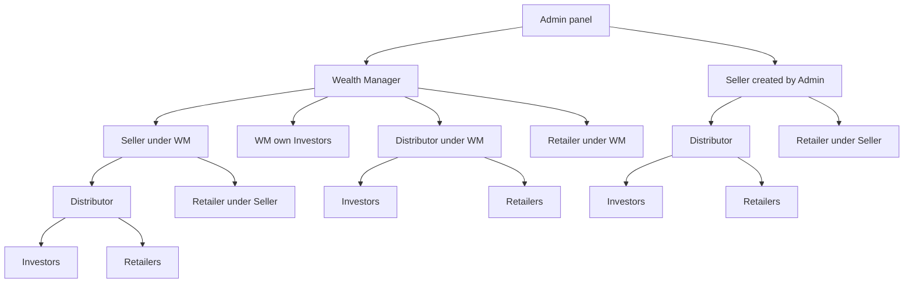

# Flow A — Channel hierarchy (WM, Admin Seller, Distributor, Retailer)

**In one sentence:** **Wealth Manager** is the main channel character (own investors + Distributor/Retailer/Seller). **Seller** can also be created from the **Admin panel** (like WM). Seller has **Distributor** and **Retailer** below them, but **no own investors**.

## Confirmed hierarchy

### Path 1 — Wealth Manager (main channel)

```text
Wealth Manager (main)
├── Seller (created by WM)
│   ├── Distributor (under Seller)
│   │   ├── Distributor’s Investors
│   │   └── Distributor’s Retailers → Investors
│   └── Retailer (direct under Seller) → Investors
├── Wealth Manager’s own Investors
├── Distributor (direct under WM)
│   ├── Distributor’s Investors
│   └── Distributor’s Retailers → Investors
└── Retailer (direct under WM) → Investors
```

### Path 2 — Seller created from Admin panel

```text
Admin creates Seller  (same idea as creating WM)
├── Distributor (under Seller)
│   ├── Distributor’s Investors
│   └── Distributor’s Retailers → Investors
└── Retailer (direct under Seller) → Investors
   (Seller does NOT have own investors)
```



## Who creates whom

| Actor | Created by | Can create / have below | Own investors? |
|-------|------------|-------------------------|----------------|
| **Wealth Manager** | **Admin panel** | Seller, Distributor, Retailer (direct); own investors | **Yes** |
| **Seller** | **Admin panel** *or* **WM** | Distributor, Retailer (direct); companies/prices/deals | **No** |
| **Distributor** | WM or Seller | Own retailers; own investors | **Yes** |
| **Retailer** | WM, Seller, or Distributor | Own investors only | **Yes** |

## Steps

1. **What happens:** Admin creates a **Wealth Manager** and/or a **Seller** from the admin panel (Seller creation is like creating WM).  
   **Result:** Top partners exist.

2. **What happens (WM path):** WM creates Seller / Distributor / Retailer and **own investors**.  
   **Result:** Full WM channel tree.

3. **What happens (Seller path):** Seller (from Admin or under WM) creates **Distributor** and **Retailer** below them — **not** own investors.  
   **Result:** Channel under Seller; investing is done by Distributor/Retailer for *their* investors.

4. **What happens:** Distributor creates own investors and own retailers; Retailer creates own investors.  
   **Result:** Investors always sit under WM, Distributor, or Retailer — never under Seller.

## Rules to remember

| Rule | Meaning |
|------|---------|
| Admin creates WM **or** Seller | Seller can start from admin like WM |
| Both paths | WM can still create Seller under WM |
| Seller channel | Seller can have **Distributor** and **Retailer** below |
| Seller investors | **No** — Seller does not have own investors |
| Who invests | WM / Distributor / Retailer for their own investors |

## When this flow ends

Channel ownership and who may create investors is clear.

## Next flow

→ [Seller registers a company](seller-register-company.md)

## Related

- [Whole project flow](../whole-project-flow.md)  
- [Actors hub](../../actors/README.md)  
- [Partner module](../../modules/partner-business.md)

---

## For technical team

**Target:** Admin partner CRUD creates WM and Seller; Seller `parent_id` may be null (admin-created) or WM; Distributor/Retailer `parent_id` → WM or Seller; investors never `partner_id` of a Seller type. Code later.
