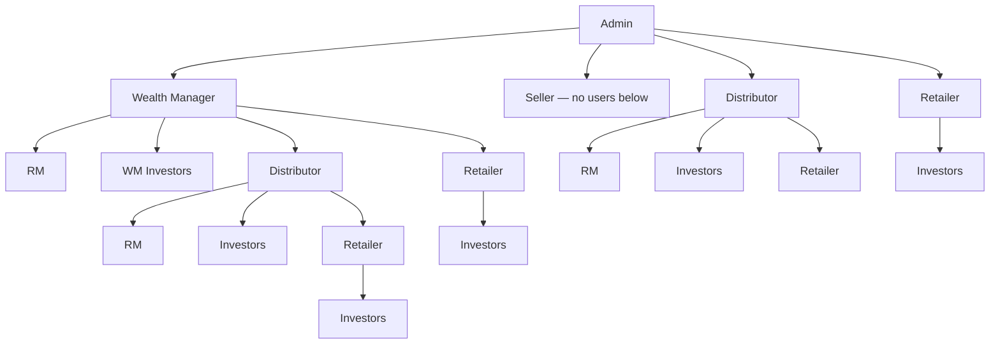

# Channel hierarchy — New system

**In one sentence:** **Admin** creates **WM**, **Seller**, **Distributor**, and **Retailer**. **WM cannot create Seller**. **Seller** is inventory-only (no users under them). **Channel partners** (WM / Distributor / Retailer) own investors; **RM** manages company data and assigns investors for WM and Distributor.

---

## Two kinds of roles

| Kind | Roles | Meaning |
|------|--------|---------|
| **Channel partner** | Wealth Manager, Distributor, Retailer | Build channel, own investors, invest / sell-request |
| **RM (Relation Manager)** | Relation Manager | Manage **company data** for their WM or Distributor; **assign investors** |
| **Seller** | Seller | Inventory only (companies, prices, deals). **Cannot create any other user** |

---

## Who creates whom

| Role | Created by | Can create below | Own investors? | Has RM? |
|------|------------|------------------|----------------|---------|
| **Wealth Manager** | **Admin only** | Distributor, Retailer, own investors, **RM** | **Yes** | **Yes** — RM manages WM company data & assigns investors |
| **Seller** | **Admin only** | **Nobody** (Seller only) | **No** | No |
| **Distributor** | **Admin** *or* **WM** (as channel partner) | Retailers (channel), own investors, **RM** | **Yes** | **Yes** — same idea as WM |
| **Retailer** | **Admin** *or* **WM** (as channel partner) *or* **Distributor** | Own investors only | **Yes** | No (only manages investors) |
| **RM** | **WM** or **Distributor** (for their company) | Assigns / manages investors for that partner’s company data | Works on behalf of WM/Distributor | — |

**Rules confirmed**
- WM **cannot** create Seller  
- Seller **cannot** create another user — Seller is simple, only Seller  
- Else channel rules as above  

---

## Trees

### Admin creates top partners

```text
Admin panel
├── Wealth Manager
│     ├── RM (manage company data, assign investors)
│     ├── WM’s own Investors
│     ├── Distributor (WM channel partner)
│     │     ├── RM
│     │     ├── Distributor’s Investors
│     │     └── Retailers → Investors
│     └── Retailer (WM channel partner) → Investors
├── Seller                    ← inventory only; no users below
├── Distributor               ← can also be created by Admin
│     ├── RM
│     ├── Investors
│     └── Retailers → Investors
└── Retailer                  ← can also be created by Admin
      └── Investors only
```



---

## What each role does

### Wealth Manager (channel partner)
- Created by **Admin**
- Creates **Distributor**, **Retailer**, **own investors**, and **RM**
- RM manages **company data** for the WM and **assigns investors**
- Invests / sell-requests like other channel partners

### Seller
- Created by **Admin only**
- Registers companies, uploads prices/deals, bank/demat
- **Does not** create WM, Distributor, Retailer, RM, or investors

### Distributor (channel partner)
- Created by **Admin** or by **WM**
- Creates **Retailers**, **own investors**, and **RM**
- RM manages distributor company data and assigns investors

### Retailer (channel partner)
- Created by **Admin**, **WM**, or **Distributor**
- **Only** manages **own investors** (no RM in this story)

### RM (Relation Manager)
- Belongs to a **WM** or **Distributor**
- Manages **all company data** for that partner
- **Assigns investors** for that partner’s company

---

## Related

- [START-HERE](../START-HERE.md)
- [Actors](../actors/README.md)
- [Diagrams](../diagrams/README.md)
- [Partner module](../modules/partner-business.md)

---

## For technical team

**Target:** Admin creates WM/Seller/Distributor/Retailer; WM does not create Seller; Seller has no child partners; RM under WM/Distributor for company data + investor assignment. Code later.
