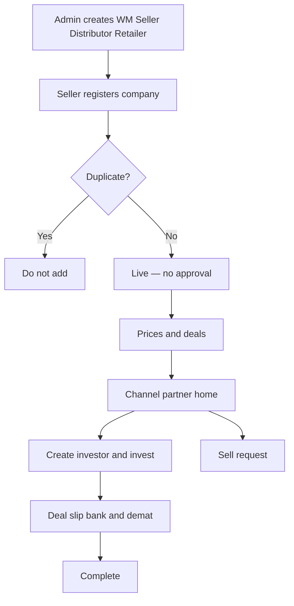

# Whole project flow — New system

> **Start at [START-HERE.md](../START-HERE.md)**

**In one sentence:** Admin creates channel partners and Seller; Seller supplies inventory; WM / Distributor / Retailer invest (RM supports company data / investor assignment).

---

## Flowchart

---

## Story by topic

**Hierarchy** — Channel partner vs RM; WM cannot create Seller; Seller creates no users.  
→ [Hierarchy](flows/wm-create-seller-distributor.md)

**Seller inventory** — Company, prices, deals.  
→ [Register](flows/seller-register-company.md) · [Deals](flows/seller-prices-and-deals.md)

**Channel marketplace** — Home, invest, deal slip.  
→ [Home](flows/partner-discovers-company.md) · [Investor](flows/partner-create-investor.md) · [Invest](flows/partner-invest-for-investor.md) · [Complete](flows/order-to-complete.md)

**Sell request** → [Sell](flows/partner-sell-request.md)

---

## Related

- [START-HERE](../START-HERE.md) · [Diagrams](../diagrams/README.md) · [Actors](../actors/README.md)
