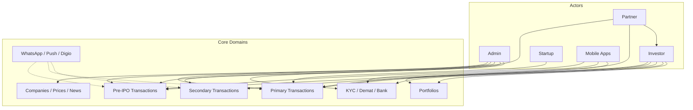

# Project Overview

## What PrivateDeals is

**PrivateDeals V1** is an investment marketplace platform focused on Indian private markets:

1. **Pre-IPO / unlisted equity** — browse companies, buy/sell unlisted shares, track portfolio and prices.
2. **Startup primary fundraising** — investors commit to startup rounds; paperwork (SSA, offer letter, MGT-14, PAS-3, SHA) and payments are tracked through statuses.
3. **Secondary market** — investor-to-investor (or related) share transfers with ROFR, escrow, and share-receipt flows.
4. **Partner / business network** — wealth managers, distributors, retailers, relation managers, and (target) **sellers** as a partner role. Partners create investors and invest for them. Sellers register companies that are **live immediately** (no approval; block if company already exists).
5. **Startup operators** — startups manage rounds, MIS, updates, cap table related flows (web; some routes historically commented).
6. **Admin operations** — can see/monitor master data, KYC, transactions, broadcasts, CMS, settings.

**Stakeholder walkthrough:** [Whole project flow](workflows/whole-project-flow.md) · [Actors hub](actors/README.md)

Mobile clients consume **REST APIs** (`/api/v1`, `/api/v2`). Admins and some users use **Blade + Livewire** web UIs.

Brand / app name in env: `APP_NAME` (example: `PrivateDeals V1 Alpha`).

---

## Primary actors

| Actor | Auth model | Web guard | API guard | Notes |
|-------|------------|-----------|-----------|--------|
| Admin | `UserAdminModel` (`user_admin`) | `admin` (session) | — | Spatie-style permission strings via `hasPermission` |
| Investor | `InvestorModel` (`investor`) | `investor` | `investor-api-guard` (Sanctum) | MPIN, family profiles, KYC |
| Partner (Business) | `PartnerModel` (`partner`) | `partner` | `partner-api-guard` | Types: WM, Distributor, Retailer, RM; **Seller** = target partner role (code later). Partners create investors & invest for them. |
| Startup | `StartupModel` (`startup`) | `startup` | `startup-api-guard` | Limited API surface today |
| Guest / public | — | — | Header `headtoken` only | Marketing site + public master APIs |

---

## Product domains (high level)

---

## Repository layout (important paths)

| Path | Role |
|------|------|
| `app/Http/Controllers/Web/` | Admin + Front web controllers |
| `app/Http/Controllers/Api/` | V1 / V2 / master / forge OCR |
| `app/Http/Controllers/ThirdParty/` | Sandbox external startup APIs |
| `app/Http/Middleware/` | Multi-actor redirects, API auth, permissions |
| `app/Models/` | ~136 Eloquent models (table names often singular) |
| `app/Helpers/` | **Primary business logic** for transactions, Digio, files, WhatsApp |
| `app/Services/` | Narrow services (FCM, Demat KYC/PDF, Pre-IPO timers/business days) |
| `app/Repositories/` | Investor/Partner/Startup repositories (partial V2) |
| `app/Jobs/` | Queue jobs (notifications, Pre-IPO, secondary, KYC) |
| `app/Enums/` | Status/type enums — prefer these over magic strings |
| `app/Console/` + `routes/console.php` | Artisan commands + schedule |
| `routes/web.php` | Large web route map |
| `routes/api.php` | API v1/v2 + webhooks |
| `resources/views/` | Blade: `admin`, `front`, `layouts`, `pdf`, … |
| `database/migrations/` | Schema history (~363 files) |
| `config/` | Laravel + `settings.php`, `backup.php`, `google.php`, … |

---

## What this project is *not*

- Not a microservices architecture — single Laravel monolith.
- Not event-driven: **no** `app/Events` / `app/Listeners` tree found; side effects are mostly synchronous helper calls + queued jobs.
- Not a thin-controller / rich-service design — many flows live in very large controllers (especially `Api\V2\Investor\CommonController`).

---

## Related docs

- [architecture/overview.md](architecture/overview.md)
- [modules/](modules/)
- [features/](features/)
