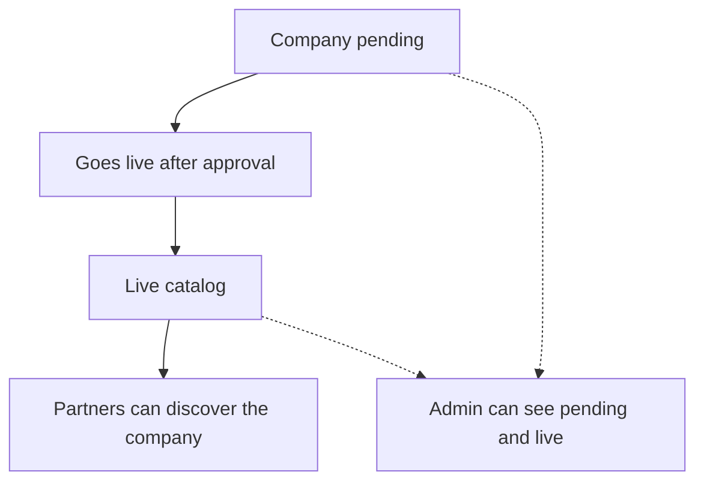

# Flow C — Company goes live

**In one sentence:** After approval, the Seller’s company becomes live and partners can see it.

## Who is involved

| Role | What they do |
|------|----------------|
| Seller | Waiting for the company to go live |
| Approval gate | Company moves from pending → live |
| Admin | Can see pending and live companies |
| Partner | Can see the company only after it is live |

## Flowchart

## Steps

1. **What happens:** Pending company is reviewed.  
   **Result:** Decision to approve (go live) or reject.

2. **What happens:** On approval, company enters the **live** catalog.  
   **Result:** Partners can find it on home/list/detail views.

3. **What happens:** If rejected, company does not go live.  
   **Result:** Partners still cannot see it; Seller may correct and resubmit (ops process).

## When this flow ends

Company is **live** (or remains not live if rejected). Live is the gate before prices, discovery, and investment.

## Next flow

→ [Seller sets prices and deals](seller-prices-and-deals.md)

## Related

- [Whole project flow](../whole-project-flow.md)  
- Previous: [Seller registers a company](seller-register-company.md)

---

## For technical team

Approval status on company; approved scope used by partner business APIs. Admin pending-seller company queue exists in current admin UI.
