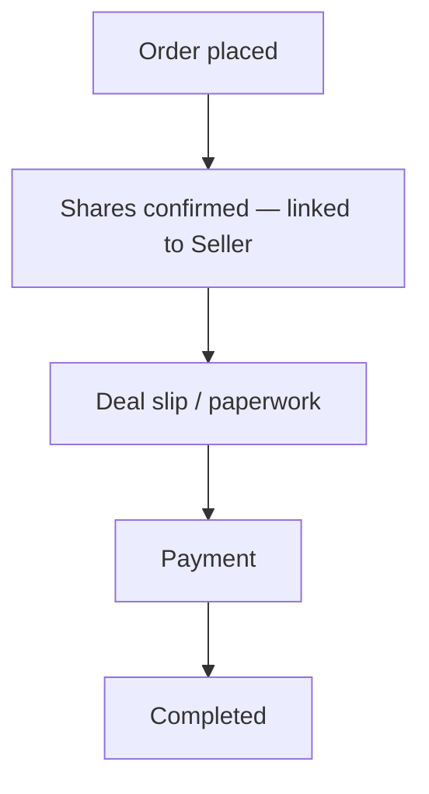

# Flow H — Order completes

**In one sentence:** The investment order is confirmed, processed, and finished; the Seller can track progress.

## Who is involved

| Role | What they do |
|------|----------------|
| Partner | Follows status for their investor’s order |
| Seller | Tracks the order linked to them |
| Admin | Can see order progress |
| Investor (record) | Ends with completed investment / portfolio impact |

## Flowchart

## Steps

1. **What happens:** Order is confirmed (shares confirmed).  
   **Result:** Order is linked to the Seller; Seller can see it in their list.

2. **What happens:** Deal slip / paperwork path runs.  
   **Result:** Documentation step completed.

3. **What happens:** Payment is recorded.  
   **Result:** Commercial settlement progresses.

4. **What happens:** Order is marked **complete**.  
   **Result:** Investment finished; portfolio reflects the holding where applicable.

## When this flow ends

The marketplace path for this company → investor order is **done**.

## Back to the big picture

→ [Whole project flow](../whole-project-flow.md)

## Related

- Previous: [Partner invests for that investor](partner-invest-for-investor.md)  
- [Pre-IPO feature](../../features/pre-ipo.md)

---

## For technical team

Typical Pre-IPO status path: placed → (reject) or confirm → deal slip → payment → complete. Digio webhooks may advance deal-slip status. See `PreIpoTransactionHelper` and admin Pre-IPO transaction screens.
