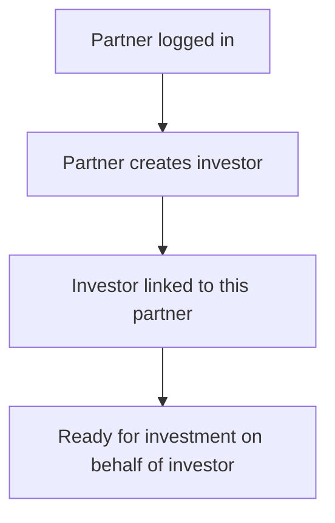

# Flow F — Partner creates an investor

**In one sentence:** The Partner creates an investor record that belongs to them — investors do not self-register in this product path.

## Who is involved

| Role | What they do |
|------|----------------|
| Partner | Creates the investor |
| Investor (record) | Belongs to the partner; does not drive this flow |
| Admin | Can see investor records |

## Flowchart

## Steps

1. **What happens:** Partner opens “create investor” in the business app.  
   **Result:** Form for investor profile details.

2. **What happens:** Partner saves the investor.  
   **Result:** Investor is stored under that partner (`partner` ownership).

3. **What happens:** Partner can manage this investor for investments and portfolio views.  
   **Result:** Investment path is partner-led.

## When this flow ends

An investor exists and is tied to the Partner.

## Next flow

→ [Partner invests for that investor](partner-invest-for-investor.md)

## Related

- [Whole project flow](../whole-project-flow.md)  
- Previous: [Partner sees the company](partner-discovers-company.md)

---

## For technical team

Business investor create sets `investor.partner_id` to the authenticated partner. Self-register investor APIs may exist in code but are **out of scope** for this stakeholder product path.
