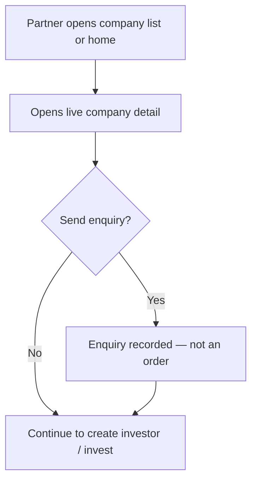

# Flow E — Partner sees the company

**In one sentence:** After a company is live, the Partner browses it (and may send an enquiry).

## Who is involved

| Role | What they do |
|------|----------------|
| Partner | Views live companies; may create an enquiry |
| Seller | May later see sell-side interest / enquiries |
| Admin | Can see enquiries |

## Flowchart

## Steps

1. **What happens:** Partner opens Pre-IPO / company lists (business app).  
   **Result:** Only **live** (approved) companies appear.

2. **What happens:** Partner opens company detail (prices, deals, info).  
   **Result:** Partner understands the opportunity.

3. **What happens (optional):** Partner submits a buy/sell **enquiry**.  
   **Result:** Interest is recorded. This does **not** automatically create an investment order.

## When this flow ends

Partner has discovered the company and may have logged interest.

## Next flow

→ [Partner creates an investor](partner-create-investor.md)

## Related

- [Whole project flow](../whole-project-flow.md)  
- Previous: [Seller sets prices and deals](seller-prices-and-deals.md)

---

## For technical team

Partner V2: business home/list/detail; enquiries create API; seller may list sell enquiries. Enquiry completion is ops/admin — not auto-buy.
