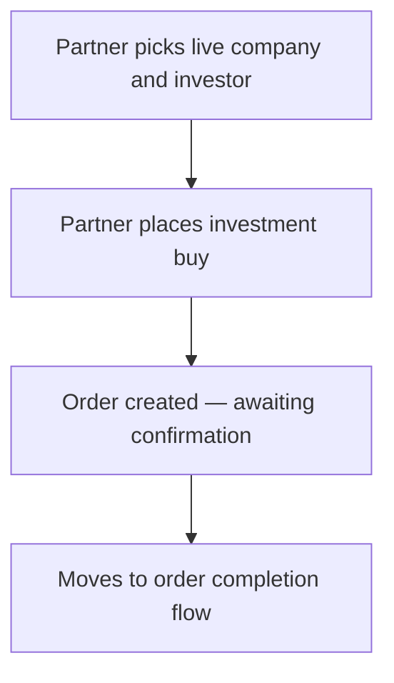

# Flow G — Partner invests for that investor

**In one sentence:** The Partner places a Pre-IPO / unlisted investment **on behalf of** the investor they created.

## Who is involved

| Role | What they do |
|------|----------------|
| Partner | Chooses company and places the buy for their investor |
| Investor (record) | Named on the order; does not place the order themselves in this path |
| Seller | Will later see / track the order when assigned |
| Admin | Can see orders |

## Flowchart

## Steps

1. **What happens:** Partner selects the live company and the investor under them.  
   **Result:** Context for the order is clear.

2. **What happens:** Partner submits the Pre-IPO / unlisted **buy**.  
   **Result:** An investment order is created (not finished yet).

3. **What happens:** Order waits for confirmation / processing steps.  
   **Result:** Flow continues to completion tracking.

## When this flow ends

An investment **order exists** for the partner’s investor (not yet fully completed).

## Next flow

→ [Order completes](order-to-complete.md)

## Related

- [Whole project flow](../whole-project-flow.md)  
- Previous: [Partner creates an investor](partner-create-investor.md)  
- [Pre-IPO buy/sell (technical)](../pre-ipo-buy-sell.md)

---

## For technical team

Partner business Pre-IPO buy reuses investor buy paths in V1; creates `pre_ipo_transaction` (typically status placed/pending confirmation). Seller assignment often at confirm time in current ops.
