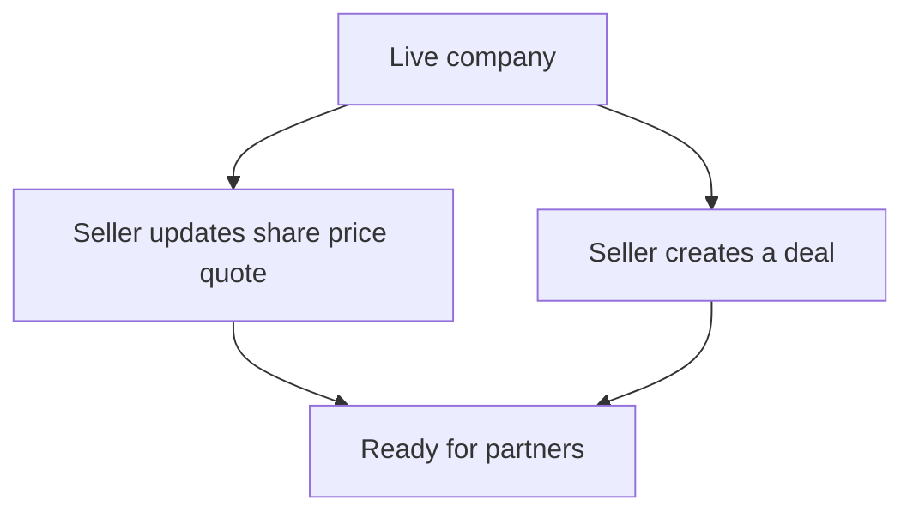

# Flow D — Seller sets prices and deals

**In one sentence:** On a live company, the Seller publishes prices and/or deals so partners have something to offer.

## Who is involved

| Role | What they do |
|------|----------------|
| Seller | Sets share quotes and/or creates deals |
| Partner | Sees pricing/deals when browsing the live company |
| Admin | Can see market data and deals |

## Flowchart

## Steps

1. **What happens:** Seller opens a **live** company they submitted (or manage).  
   **Result:** Company is editable for commercial data.

2. **What happens:** Seller updates share price / quote information.  
   **Result:** Partners can see pricing context on company views.

3. **What happens:** Seller may create a **deal** (inventory / offer package).  
   **Result:** Deals can appear for partners (for example hot deals / company detail).

## When this flow ends

Live company has commercial information partners can use.

## Next flow

→ [Partner sees the company](partner-discovers-company.md)

## Related

- [Whole project flow](../whole-project-flow.md)  
- Previous: [Company goes live](company-goes-live.md)  
- [Companies & pricing](../../features/companies-pricing.md)

---

## For technical team

Seller quotes and `company_deals`; partner V2 may expose distributor/base style prices from seller quotes. Admin can also manage market prices and deals.
