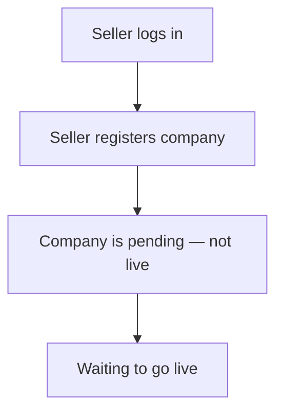

# Flow B — Seller registers a company

**In one sentence:** The Seller submits a new company; it is not live until approval.

## Who is involved

| Role | What they do |
|------|----------------|
| Seller | Registers / submits the company |
| Admin | Can see the pending company (monitor / approval gate) |
| Partner | Cannot see this company yet |

## Flowchart

## Steps

1. **What happens:** Seller logs into their partner/seller workspace.  
   **Result:** Seller is authenticated.

2. **What happens:** Seller enters company details and submits.  
   **Result:** Company is saved as **pending** (not visible to partners yet).

3. **What happens:** Admin (and ops) can see the pending submission.  
   **Result:** Company waits for the go-live step.

## When this flow ends

A company exists in **pending** state. Partners still cannot discover it.

## Next flow

→ [Company goes live](company-goes-live.md)

## Related

- [Whole project flow](../whole-project-flow.md)  
- Previous: [Wealth Manager creates Seller](wm-create-seller-distributor.md)

---

## For technical team

Target/current seller submit: company with pending approval and link to submitting seller. Partners only list **approved** companies. See [companies-pricing.md](../../features/companies-pricing.md).
