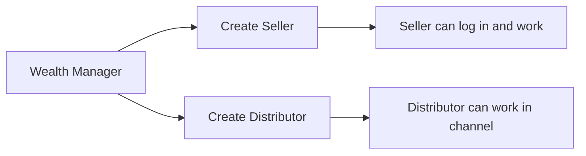

# Flow A — Wealth Manager creates Seller and Distributor

**In one sentence:** A Wealth Manager adds Seller and Distributor partners under the partner network.

## Who is involved

| Role | What they do |
|------|----------------|
| Wealth Manager | Creates Seller and Distributor |
| Seller | New partner role (inventory / companies) — created here |
| Distributor | Channel partner — created here |
| Admin | Can see partner records (monitor only in this story) |

## Flowchart

## Steps

1. **What happens:** Wealth Manager opens partner management and creates a **Seller**.  
   **Result:** Seller exists as a partner role (target model).

2. **What happens:** Wealth Manager creates a **Distributor** the same way (when needed).  
   **Result:** Distributor is available in the channel hierarchy.

3. **What happens:** Other partner types (Retailer, Relation Manager) continue as today — not redefined here.  
   **Result:** Network structure stays clear: WM can create Seller + Distributor.

## When this flow ends

Seller (and optionally Distributor) accounts exist and can take part in the marketplace.

## Next flow

→ [Seller registers a company](seller-register-company.md)

## Related

- [Whole project flow](../whole-project-flow.md)  
- [Actors hub](../../actors/README.md)  
- [Partner module](../../modules/partner-business.md)

---

## For technical team

**Target:** `partner.type` includes Seller; WM create rules allow Seller + Distributor.  
**Current code:** `PartnerTypeEnum` has wealthmanager, distributor, retailer, relationmanager only — Seller as partner type is **not implemented yet** (docs-first; code later). Separate `seller_master` may still exist.
