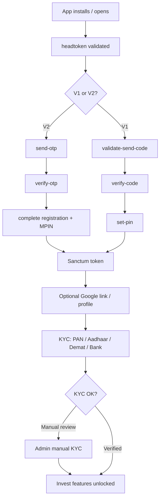

# Workflow: Investor Onboarding

## Key files

- V2: `Api\V2\Investor\AuthController`, KYC methods on `CommonController`
- V1: `Api\V1\Investor\LoginController`, `CommonKycController`
- Digio: `DigioHelper`
- Jobs: KYC notification / reminder jobs
- Admin: manual KYC routes

## Business rules

- MPIN required for login (V2) and sensitive checks
- Referral code optional at V2 complete
- Pending KYC reminders run hourly when scheduled

## Side effects

- Device token registration (guest + authenticated)
- WhatsApp/push may fire on KYC completion / manual review

## Related

- [features/kyc-demat.md](../features/kyc-demat.md)
- [authentication/overview.md](../authentication/overview.md)
