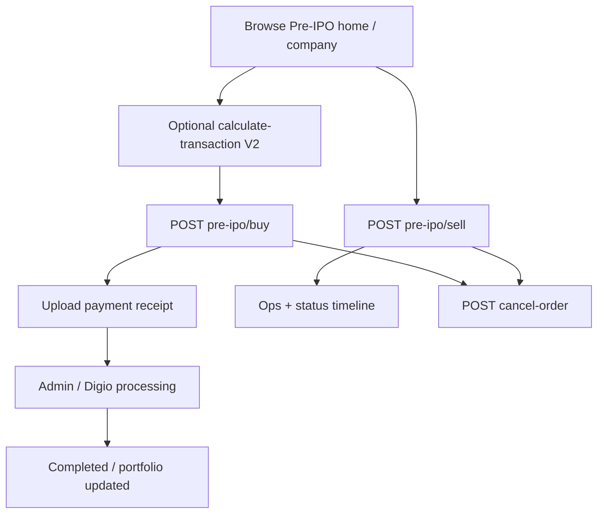

# Workflow: Pre-IPO Buy / Sell

## Entry APIs

- V1/V2 investor + V1 business buy/sell/cancel
- V1 `POST pre-ipo/buy` accepts optional `seller_id` (integer for all rows, or parallel array) — stored on `pre_ipo_transaction.seller_id` at create time
- V2 payment receipt upload + calculate
- Status detail endpoints for timelines

## Core code

- Controllers: V1/V2 Investor `CommonController` (`preIpoBuy`, `preIpoSell`, `cancelOrder`, …)
- `PreIpoTransactionHelper`, `TransactionCalculationHelper`
- Model: `PreIpoModel` (`pre_ipo_transaction`)
- Admin: `PreIpoTransactionController`

## Preserve

- Status list helpers for mobile steppers
- Coupon application rules on V2
- `company.type` filtering on business discovery APIs
- Notification jobs on buy/cancel

## Related

- [features/pre-ipo.md](../features/pre-ipo.md)
- [api/v2.md](../api/v2.md)
