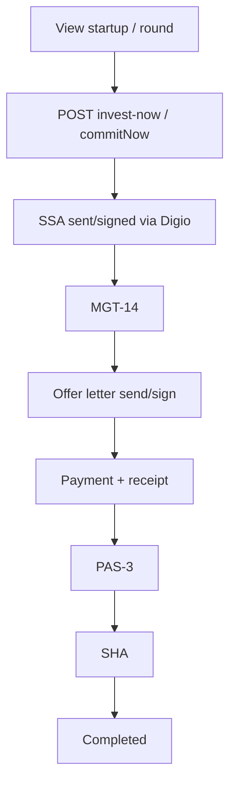

# Workflow: Primary Investment

Statuses are defined in `PrimaryTransactionStatusEnum` and advanced via `PrimaryTransactionHelper` + Digio webhooks + admin/startup uploads.

## Actors

- Investor / partner apps create commitment
- Admin / startup ops upload legal docs
- Digio handles e-sign where configured

## Related

- [features/primary-transactions.md](../features/primary-transactions.md)
- [modules/startup.md](../modules/startup.md)
