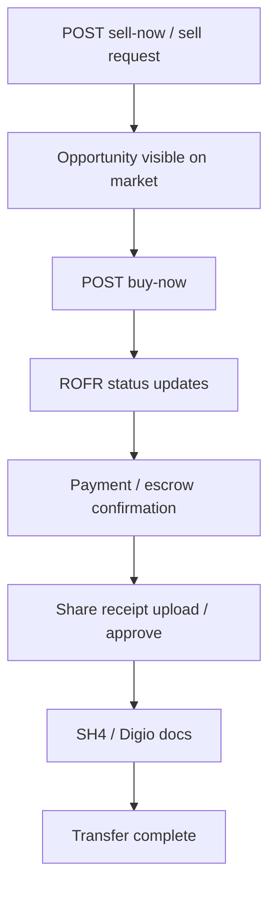

# Workflow: Secondary Trade

## Core code

- API: V1 `secondary-invest/*`
- `SecondaryTransactionHelper` (`allotShares`, `sendSH4`, status changers)
- Jobs: `SecondaryAllocationJob`, `SecondaryRofrJob`
- Models: `SecondarySellRequestModel`, `SecondaryTransactionModel`, payments/escrow/transfer models

## Preserve

- Role checks on approve/payment-received endpoints
- Notification keys to seller/buyer

## Related

- [features/secondary-market.md](../features/secondary-market.md)
